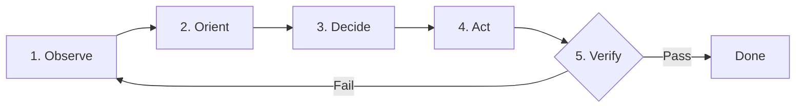

# The Ralph Autonomous Self-Correction Loop

The Ralph Loop is a battle-tested autonomous feedback and self-correction loop designed to prevent premature halts, eliminate circular failure traps, and guarantee deterministic task completion.

---

## 🔁 The 5 Phases of the Ralph Loop

### Phase 1: OBSERVE (Signal Ingestion)
- Capture the raw, unadulterated diagnostic signal:
  - Exact command stdout and stderr.
  - Compiler and lint diagnostic codes (e.g., TS2345, TS2322).
  - Runtime exception traces and HTTP response codes.
  - Database error payloads (e.g., foreign key violations, RLS denial).
- **Rule:** Never interpret before observing the raw diagnostic output.

### Phase 2: ORIENT (Constraint & Root Cause Analysis)
- Cross-reference the observed symptom against system invariants:
  - Is the database schema out of sync with Prisma?
  - Are environment variables missing or malformed?
  - Is there a type mismatch between API route request and response?
  - Are we running in a Windows PowerShell environment with quoting or operator nuances?
- Eliminate false leads: discard fixes that merely mask the symptom without addressing the root cause.

### Phase 3: DECIDE (Surgical Intervention Strategy)
- Formulate a single, minimal hypothesis:
  - *"If I update the Zod schema to allow the optional field, the endpoint will validate and pass."*
  - *"If I cast the parameter or adjust the nullability check, TypeScript will compile clean."*
- Reject "shotgun debugging" (changing multiple unrelated things at once).

### Phase 4: ACT (Precise Execution)
- Apply the targeted file edit using precise line ranges.
- Ensure all imports, syntax, and formatting remain clean.

### Phase 5: VERIFY (Deterministic Proof)
- Re-run the exact command or test that previously failed.
- **Decision Branch:**
  - **If Passed:** Conclude the loop, commit the working state, and proceed.
  - **If Failed:** Ingest the *new* error signal, increment loop iteration counter, and loop back to **Phase 1** without repeating the previous failed action.

---

## 🚫 Anti-Patterns Forbidden by Ralph Loop
1. **Never Give Up on First Failure:** An error is simply data guiding the next iteration.
2. **Never Propose Hypothetical Fixes:** Apply the fix and test it yourself; do not ask the user to test it for you.
3. **Never Repeat the Same Failed Command:** If `command X` failed with error `Y`, running `command X` again without code changes will yield error `Y`. Always mutate state before re-verifying.
4. **Never Mask Errors with `any` or Empty Catches:** Fix the underlying schema or type constraint.
