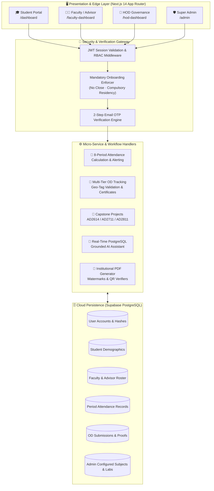

# 🎓 V.S.B. Engineering College (Autonomous)
## 🚀 Department of Artificial Intelligence & Data Science (AI & DS)
### Enterprise Digital Campus Portal · Autonomous Cloud Architecture

<div align="center">


[](https://nextjs.org/)
[](https://react.dev/)
[](https://www.typescriptlang.org/)
[](https://tailwindcss.com/)
[](https://www.prisma.io/)
[](https://supabase.com/)
[](https://app-two-plum-10.vercel.app)
[](https://render.com)
[](https://ai.google.dev/)
[](https://web.dev/progressive-web-apps/)

</div>

---

## 📑 Interactive Table of Contents
1. [🌐 Website Overview & Live Endpoints](#-1-website-overview--live-deployment-details)
2. [🏛️ Architectural System Topology](#-2-architectural-system-topology)
3. [🔐 Unified Authentication & Role Matrix](#-3-unified-authentication--role-matrix)
4. [👥 Multi-Tier Functional Portals](#-4-multi-tier-functional-portals)
   - [🎓 Student Academic Portal](#-a-student-academic-portal-dashboard)
   - [👨‍🏫 Faculty & Class Advisor Portal](#-b-faculty-directorate--class-advisor-portal-faculty-dashboard)
   - [👑 Head of Department (HOD) Portal](#-c-head-of-department-hod-governance-portal-hod-dashboard)
   - [🛡️ System Administrator Command Center](#-d-system-administrator-command-center-admin)
5. [⏰ Master 8-Period Bell Timings](#-5-institutional-master-8-period-bell-timings)
6. [🗄️ Database Architecture & Entity Schema](#-6-database-architecture--entity-schema)
7. [💻 Full-Stack Engineering Specifications](#-7-full-stack-engineering-specifications)
8. [🛠️ Local Installation & Development](#-8-local-installation--development)
9. [🚢 Continuous Deployment Pipelines](#-9-continuous-deployment-pipelines)
10. [🏛️ Institutional Identity & Accreditation](#-10-institutional-identity--accreditation)

---

## 🌐 1. Website Overview & Live Deployment Details

The **V.S.B. AI & DS Enterprise Digital Portal** is an autonomous, production-grade cloud management system developed for the **Department of Artificial Intelligence & Data Science** at **V.S.B. Engineering College (Autonomous), Karur**.

The ecosystem replaces disjointed legacy paperwork, spreadsheets, and manual registers with a synchronized, role-based platform covering real-time 8-period attendance tracking, On-Duty (OD) verification with geo-tag validation, capstone project lifecycle tracking, unit-wise academic repository distribution, and executive analytics.

### 🔗 Production Endpoints & Live Services
| Channel / Service | Status | Target URI / Identifiers |
| :--- | :---: | :--- |
| **Primary Production URL** | 🟢 `Active` | [https://app-two-plum-10.vercel.app](https://app-two-plum-10.vercel.app) |
| **Alternate Production Domain** | 🟢 `Active` | [https://app-4t01s1pjl-logeshwaran.vercel.app](https://app-4t01s1pjl-logeshwaran.vercel.app) |
| **Render API & Worker Engine** | 🟢 `Live` | Service ID: `srv-dad5vm2jnfac73ejaf4g` (`vsb-aids-portal`) |
| **Enterprise Cloud Database** | 🟢 `Connected` | PostgreSQL on Supabase Cloud (PgBouncer Connection Pooling) |
| **Official GitHub Repository** | 🟢 `Synchronized` | [https://github.com/logeshwaran2097-hue/AIDS-Digital-Portal](https://github.com/logeshwaran2097-hue/AIDS-Digital-Portal) |

### 🎯 Key System Principles
- **100% Zero-Mock Guarantee**: Every statistic, student roster, subject list, and lab entry is queried dynamically from live PostgreSQL tables. Admin-enrolled records are the sole source of truth.
- **Hierarchical Institutional Workflows**: Rigid enforcement of institutional approval chains (`Student Submission` ➔ `Class Advisor Verification` ➔ `HOD Final Approval`).
- **Enforced First-Time Security Onboarding**: Non-dismissible mandatory onboarding modal enforcing permanent password initialization, 2-Step Email OTP verification, verified contact records, and compulsory residency & transport selection.
- **Dynamic Curriculum Administration**: No hardcoded courses or subjects. Department curricula and lab syllabi are dynamically provisioned, updated, and managed by administrators.

---

## 🏛️ 2. Architectural System Topology



---

## 🔐 3. Unified Authentication & Role Matrix

The platform provides role-based authentication enforcing specific login credentials and secondary identifiers across all user classifications:

| Role | Portal Route | Primary Login Identifier | Secondary Login Identifier | Credentials / 2FA |
| :--- | :--- | :--- | :--- | :--- |
| **Student** | `/dashboard` | Register Number (e.g., `922525243103`) | or email id | Password + 2-Step OTP on first login |
| **Faculty** | `/faculty-dashboard` | Official Email ID (e.g., `karthik@vsb.edu.in`) | Faculty Name (e.g., `Karthik S`) | Password |
| **Class Advisor** | `/faculty-dashboard` | Official Email ID (e.g., `karthik@vsb.edu.in`) | Advisor Name (e.g., `Karthik S`) | Password |
| **HOD** | `/hod-dashboard` | Official Email ID (e.g., `hod.aids@vsb.edu.in`) | HOD Name (e.g., `karthikk S`) | Password |
| **Super Admin** | `/admin` | Administrator Email ID (e.g., `admin@aids`) | — | Secure Login OTP (Passwordless 2FA via Email) |

---

## 👥 4. Multi-Tier Functional Portals

### 🎓 A. Student Academic Portal (`/dashboard`)
The student portal provides an autonomous environment tailored to individual degree progression:
- **Mandatory First-Time Onboarding**:
  - Non-dismissible verification workflow requiring completion of profile details.
  - Compulsory **Residency & Transport** declaration (Day Scholar college bus route / private transport / campus hostel room).
  - Permanent password configuration and 6-digit Email OTP confirmation.
- **Live 8-Period Attendance Dashboard**:
  - Real-time attendance gauge with automatic condonation warning indicators (<75%).
  - Period-by-period matrix displaying forenoon and afternoon status.
- **On-Duty (OD) Proofs Submission**:
  - Digital application for technical symposiums, hackathons, paper presentations, and sports.
  - Geo-tagged photo submission with EXIF location verification and event certificate upload.
  - Real-time multi-stage approval tracker (`Submitted` ➔ `Advisor Verified` ➔ `HOD Approved`).
- **Capstone Milestone Submissions**:
  - Modules for Mini-Project, Project Phase I, and Project Phase II with supervisor allocation and repository links.
- **PostgreSQL Grounded AI Assistant**:
  - Provides immediate answers to student queries regarding assigned advisors, lab schedules, attendance status, and bell timings.

---

### 👨‍🏫 B. Faculty Directorate & Class Advisor Portal (`/faculty-dashboard`)
Empowers faculty members and assigned class advisors with daily academic tools:
- **Class Advisor Supervision**:
  - Direct access to assigned student rosters (filtered by Year, Semester, and Section).
  - Daily morning first-period roll call and real-time absentee alerts.
  - **OD Verification Desk**: Review student event participation certificates, verify genuine attendance, and pass verified recommendations to the HOD.
- **Subject Faculty Execution**:
  - Period-by-period attendance registration for allocated theory and laboratory courses.
  - Course repository management (upload lecture notes, unit question banks, and reference manuals).
  - Attendance register unlock request workflow with justification remarks submitted to HOD.

---

### 👑 C. Head of Department (HOD) Governance Portal (`/hod-dashboard`)
Executive department administration and final institutional approvals:
- **Executive Analytics & Oversight**:
  - Department metrics: Total active student enrollment, teaching faculty, registered courses, and pending actions.
  - Section-wise attendance health and condonation risk tracking.
- **Multi-Tier OD Final Sign-Off**:
  - Review OD requests pre-verified and endorsed by Class Advisors.
  - View event documentation, advisor notes, and approve/reject with automated student notification.
- **Register Unlock Clearance**:
  - Review and authorize faculty requests to update closed attendance registers.
- **Institutional PDF Report Engine**:
  - Export department attendance logs, master absentee rosters, and semester performance records with official collegiate watermarks.

---

### 🛡️ D. System Administrator Command Center (`/admin`)
Root administrative governance over all system records and institutional setup:
- **Central OD & Proofs Tracking System (`/admin/od-proofs`)**:
  - Complete department pipeline across all academic years (Years 1 to 4) and sections (A to D).
  - **Visual Proof Inspector ("See the Proofs")**: High-resolution inspect modal and inline thumbnails for live geo-tagged venue photos (GPS coordinates, reverse-geocoded address, capture timestamp, and Google Maps pin) and completion certificates.
  - **Executive Jurisdiction Overrides**: Direct administrative approval, attendance credit certification, clarification directives, and record purging.
  - **Official Audit Exports**: Generation of master OD registries in PDF (with college watermark) and CSV.
- **Dynamic Curriculum Administration**:
  - Full CRUD management of departmental subjects and laboratory practicals with semester allocations.
- **Bulk CSV Student Onboarding**:
  - Institutional CSV template upload for rapid, error-free onboarding of student cohorts.
- **Zero-Mock Data Enforcement**:
  - Database utilities ensuring all visual counters and listings reflect live PostgreSQL state without dummy data.

---

## ⏰ 5. Institutional Master 8-Period Bell Timings

| Period / Slot | Time Window | Duration | Academic Classification |
| :--- | :--- | :--- | :--- |
| **Period 1** | `09:15 AM - 10:00 AM` | 45 mins | Morning Theory / Core Lecture Slot 1 |
| **Period 2** | `10:00 AM - 10:45 AM` | 45 mins | Morning Theory / Core Lecture Slot 2 |
| ☕ **Morning Break** | `10:45 AM - 11:00 AM` | 15 mins | Morning Refreshment Interval |
| **Period 3** | `11:00 AM - 11:45 AM` | 45 mins | Mid-Morning Core / Advanced Theory Slot 3 |
| **Period 4** | `11:45 AM - 12:30 PM` | 45 mins | Mid-Morning Core / Advanced Theory Slot 4 |
| 🍱 **Lunch Break** | `12:30 PM - 01:20 PM` | 50 mins | Midday Dining & Campus Interval |
| **Period 5** | `01:20 PM - 02:05 PM` | 45 mins | Afternoon Theory / Practical Lab Block Slot 5 |
| **Period 6** | `02:05 PM - 02:50 PM` | 45 mins | Afternoon Theory / Practical Lab Block Slot 6 |
| 🍵 **Tea Break** | `02:50 PM - 03:05 PM` | 15 mins | Evening Tea & Refreshment Interval |
| **Period 7** | `03:05 PM - 03:50 PM` | 45 mins | Practical Lab Block / Communication Skills |
| **Period 8** | `03:50 PM - 04:40 PM` | 50 mins | Practical Lab Block / Aptitude & Mentorship |

---

## 🗄️ 6. Database Architecture & Entity Schema

The database is built on **PostgreSQL (Supabase)** and managed using **Prisma ORM**:

```
+------------------+         +--------------------+         +-------------------+
|      User        | <-----> |      Student       | <-----> |   AttendanceRecord|
| (Auth, Role, JWT)|         | (RegNo, Year, Sec) |         | (Date, Period, P) |
+------------------+         +--------------------+         +-------------------+
         ^                             |                              |
         |                             v                              v
         |                   +--------------------+         +-------------------+
         |                   |      ODProof       |         |      Subject      |
         |                   | (Proof, Geo, Status|         | (Code, Name, Sem) |
         |                   +--------------------+         +-------------------+
         v                             ^                              ^
+------------------+                   |                              |
|     Faculty      | ------------------+------------------------------+
| (FacID, Desig)   |
+------------------+
         ^
         |
+------------------+
|       HOD        | ----> [ Final Approvals, Workload, Governance ]
+------------------+
```

### Core Schema Models
- **`User`**: Core identity model supporting roles (`student`, `faculty`, `hod`, `admin`), password hashes, and OTP state.
- **`Student`**: Academic records including register number, year, semester, section, residency status, and guardian details.
- **`Faculty`**: Faculty identifiers, designation, department, and class advisor designations.
- **`HOD`**: Department leadership profile with approval privileges.
- **`Subject`**: Dynamic curriculum subjects and laboratories managed by administrators.
- **`AttendanceRecord`**: Granular period-wise attendance entries (`present`, `absent`, `od`).
- **`ODProof`**: On-duty submissions with document URLs, geo-tag metadata, advisor verification notes, and HOD status.
- **`Project`**: Capstone milestone submissions and guide allocations.
- **`Resource` & `QuestionPaper`**: Course study materials and question banks.

---

## 💻 7. Full-Stack Engineering Specifications

| Layer | Technologies & Libraries | Architectural Highlights |
| :--- | :--- | :--- |
| **Frontend Framework** | **Next.js 14** (App Router), **React 18** | Edge rendering, Server Components, dynamic client transitions |
| **Programming Language** | **TypeScript 5.x** | Complete end-to-end type safety across client and server |
| **UI & Styling** | **Tailwind CSS**, **Lucide React** | Custom institutional design system with responsive glassmorphism |
| **Backend & Routing** | Next.js Serverless Route Handlers | Secure REST APIs with role-based JWT authorization guards |
| **Database & ORM** | **PostgreSQL (Supabase)**, **Prisma ORM 5.17** | PgBouncer connection pooling, migration management |
| **Security & Auth** | `bcryptjs`, `jose` JWT, 2-Step Email OTP | HttpOnly session tokens, encrypted credential storage |
| **PDF Engine** | `jspdf`, `jspdf-autotable` | Vector-rendered institutional letterheads, watermarks, and QR codes |
| **AI NLP Assistant** | **Google Gemini API** | Natural language queries grounded in live PostgreSQL data |
| **Hosting & Delivery** | **Vercel** & **Render** | Distributed global CDN edge deployment with background services |

---

## 🛠️ 8. Local Installation & Development

### 1. Prerequisites
- **Node.js** v18.17+ or v20+
- **npm** or **pnpm**
- **PostgreSQL Database** (e.g., Supabase or local instance)

### 2. Clone the Repository
```bash
git clone https://github.com/logeshwaran2097-hue/AIDS-Digital-Portal.git
cd AIDS-Digital-Portal
```

### 3. Install Dependencies
```bash
npm install
```

### 4. Configure Environment Variables
Create a `.env` file in the root directory:
```env
# PostgreSQL Database URL with pooling (e.g., Supabase PgBouncer)
DATABASE_URL="postgresql://postgres:[PASSWORD]@[HOST]:6543/postgres?pgbouncer=true"

# Direct PostgreSQL connection for migrations
DIRECT_URL="postgresql://postgres:[PASSWORD]@[HOST]:5432/postgres"

# JWT Secret Key
JWT_SECRET="vsb-ai-ds-super-secret-jwt-key-2026"

# Public Application URL
NEXT_PUBLIC_APP_URL="http://localhost:3000"

# Google Gemini API Key (Optional)
GEMINI_API_KEY="your-gemini-api-key"
```

### 5. Push Database Schema
```bash
npx prisma generate
npx prisma db push
```

### 6. Run the Local Development Server
```bash
npm run dev
```
Open **[http://localhost:3000](http://localhost:3000)** to view the application.

---

## 🚢 9. Continuous Deployment Pipelines

The application is configured for multi-cloud continuous delivery:
- **GitHub Version Control**: All commits to `main` undergo automated validation.
- **Vercel Edge Platform**: Automatic production deployments to [https://app-two-plum-10.vercel.app](https://app-two-plum-10.vercel.app).
- **Render Cloud Service**: High-availability background and worker service (`srv-dad5vm2jnfac73ejaf4g`).

---

## 🏛️ 10. Institutional Identity & Accreditation

<div align="center">

**V.S.B. Engineering College (Autonomous)**  
*Approved by AICTE, New Delhi · Affiliated to Anna University, Chennai*  
*Accredited with 'A' Grade by NAAC · NBA Tier-1 Accredited*  
**Department of Artificial Intelligence & Data Science**  
NH-67, Covai Road, Karur - 639 111, Tamil Nadu, India

---

Developed by **Logeshwaran G**  
*Second Year, Department of AI & DS*  
*All Rights Reserved. © 2026 V.S.B. AI & DS Enterprise Digital Portal.*

</div>
