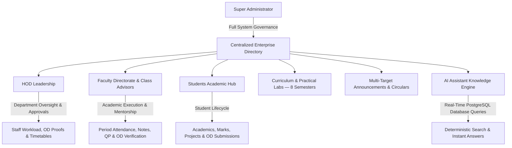

# V.S.B. Engineering College (Autonomous)
## Department of Artificial Intelligence & Data Science (AI & DS) — Enterprise Digital Portal

[](https://nextjs.org/)
[](https://www.typescriptlang.org/)
[](https://tailwindcss.com/)
[](https://www.prisma.io/)
[](https://supabase.com/)
[](https://app-two-plum-10.vercel.app)
[](https://render.com)
[](https://ai.google.dev/)

---

### Executive Overview

The **V.S.B. AI & DS Digital Portal** is a production-grade, full-stack enterprise institutional management platform tailored for the Department of Artificial Intelligence & Data Science at V.S.B. Engineering College. Built with modern web engineering standards, the system unifies students, faculty, department leadership (HOD), and system administrators into an integrated, real-time reactive ecosystem.

🌐 **Production URL**: [https://app-two-plum-10.vercel.app](https://app-two-plum-10.vercel.app)

---

## 🏗️ Architecture & Ecosystem



---

## 👥 Role-Based Portals & Capabilities

### 1. 🛡️ Super Administrator Command Center (`/admin`)
- **Centralized Administrative Directory**: 12 modular subsystems covering User Accounts, Curricula, Question Banks, Capstones, Audit Logs, and System Security.
- **Live Database Counter Metrics**: Real-time PostgreSQL statistics reflecting exact counts of enrolled students, faculty, HOD records, and active circulars.
- **Strict Data Integrity**: Every dashboard metric and directory is linked directly to live verified database records with zero synthetic mock data.
- **High-Fidelity PDF Vector Engine**: Institutional emblem-watermarked executive audit reports and data exports.

### 2. 👑 Head of Department (HOD) Leadership Portal (`/hod-dashboard`)
- **Executive Oversight & Analytics**: Department-wide monitoring of student enrollment, faculty allocations, course coverage, and class attendance averages.
- **Advisor OD Verification & Attendance Unlock Monitoring**: Real-time monitor of Class Advisor OD recommendations and attendance register unlock approvals.
- **Academic Governance**: Oversight of Class Advisors, laboratory handlers, research publications, and semester practical schedules.

### 3. 👨‍🏫 Faculty Directorate & Class Advisors (`/faculty-dashboard`)
- **Dual Role Matrix**:
  - **Class Advisor**: Manage student roster for assigned section, review absences, verify OD certificates/geo-tags, and approve OD submissions.
  - **Subject Faculty**: Manage allocated subjects, record period-wise attendance, upload lecture materials, assignments, and question papers.
- **Institutional 8-Period Bell Timings**: Built-in master timetable matrix for Theory and Practical Blocks (Forenoon: `09:15 AM - 12:30 PM` | Afternoon: `01:20 PM - 04:30 PM`).
- **Real-Time Attendance Registers**: Daily morning and period-wise attendance tracking with unlock-request protocols.

### 4. 🎓 Student Academic Portal (`/dashboard`)
- **8-Semester Curriculum & Marks**: Semester-by-semester view of core theory and practical lab subjects.
- **75% Attendance Compliance Monitor**: Real-time calculation with warning notifications for condonation thresholds below 75%.
- **Capstone Project Hub**: Submission and tracking for:
  - Year 3 Mini Projects — `AD2614`
  - Year 4 Phase I — `AD2711`
  - Capstone Final — `AD2811`
- **On-Duty (OD) & Leave Application**: Digital workflow for symposiums, sports, and medical leaves with document uploads and real-time approval tracking.

---

## 🗺️ Page Workflows & Navigation Paths

### 🎓 1. Student Workflow

#### 🔑 Login (`/login`)
- Authenticate using **Register Number** (e.g., `922525243126`) and **Password**.

#### 🚀 Onboarding (First Login)
Complete 2-step verification including:
- Email OTP verification (6-digit verification code)
- Permanent password setup
- Profile validation (Student & Parent WhatsApp Numbers, DOB, Blood Group, Hostel/Dayscholar details)
- **Review Confirmation**: Review details and proceed to dashboard.

#### 📊 Dashboard & Tools
- **Home (`/dashboard`)**: Current semester overview, attendance gauge, and announcements.
- **Attendance (`/dashboard/attendance`)**: Day-wise and period-wise breakdown across all 8 periods.
- **Study & Materials (`/dashboard/study`)**: Units, lecture notes, lab manuals, and syllabus.
- **Question Papers (`/dashboard/question-papers`)**: Internal Assessment (IAT) and university papers.
- **Projects (`/dashboard/projects`)**: Capstone milestones, abstract submission, and reviews.
- **OD & Proofs (`/dashboard/od-proofs`)**: Apply for OD, upload certificates, and track Advisor & HOD sign-offs.
- **Floating AI Assistant**: Natural-language inquiries grounded in live database data.

---

### 👨‍🏫 2. Faculty Workflow

- **Login (`/login`)**: Use Faculty ID (e.g., `FAC001`) and password.
- **Dashboard (`/faculty-dashboard`)**: Faculty schedule, assigned classes, and quick actions.
- **Class Advisor Portal (`/faculty-dashboard/students`)**: Manage class attendance, student profiles, and OD approvals.
- **Subject Portal (`/faculty-dashboard/subjects`)**: Manage subjects, periods, syllabus, and study materials.
- **Attendance Management (`/faculty-dashboard/attendance`)**: Record morning and period-wise attendance.
- **OD Verification (`/faculty-dashboard/od-proofs`)**: Review student proof documents, verify participation, and forward to HOD.

---

### 👑 3. Head of Department (HOD) Workflow

- **Login & Onboarding (`/login`)**: Authenticate using HOD credentials with first-time onboarding wizard.
- **Department Governance (`/hod-dashboard`)**: High-level department statistics, class averages, and executive actions.
- **OD Approvals Monitor (`/hod-dashboard/od-proofs`)**: Review Advisor-verified OD applications and issue departmental approval.
- **Attendance Register Approvals (`/hod-dashboard/attendance`)**: Process faculty attendance unlock requests.
- **Reports (`/hod-dashboard/reports`)**: Generate department-wide attendance and academic reports in PDF, Excel, and CSV formats.

---

### 🛡️ 4. System Administrator Workflow

- **Login (`/login`)**: Super Admin authentication with email, OTP verification, and password.
- **System Command (`/admin`)**: Metric tiles, user provisioning (Students, Faculty, HOD), and system maintenance.
- **Student Roster (`/admin/students`)**: Manual enrollment, bulk CSV upload, and profile management.
- **Curriculum & Labs (`/admin/academics`)**: Configure 8-semester subjects, practical labs, and timetable slots.

---

## 🔬 Complete 8-Semester Laboratory Curriculum

| Semester | Code | Practical Laboratory Course | Schedule / Session |
| :--- | :--- | :--- | :--- |
| **Sem 1** | `GE2111` | Problem Solving & Python Programming Laboratory | Afternoon (`01:20 PM - 04:30 PM`) |
| **Sem 1** | `BS2112` | Physics and Chemistry Laboratory | Forenoon (`09:15 AM - 12:30 PM`) |
| **Sem 1** | `GE2113` | Engineering Graphics & CAD Laboratory | Afternoon (`01:20 PM - 04:30 PM`) |
| **Sem 2** | `CS2211` | C Programming & Data Structures Laboratory | Forenoon (`09:15 AM - 12:30 PM`) |
| **Sem 2** | `EE2212` | Basic Electrical & Electronics Engineering Laboratory | Afternoon (`01:20 PM - 04:30 PM`) |
| **Sem 2** | `GE2213` | Workshop Practice Laboratory | Afternoon (`01:20 PM - 04:30 PM`) |
| **Sem 3** | `AD2311` | Object Oriented Programming Laboratory (OOP Lab) | Afternoon (`01:20 PM - 04:30 PM`) |
| **Sem 3** | `AD2312` | Database Management Systems Laboratory (DBMS Lab) | Forenoon (`09:15 AM - 12:30 PM`) |
| **Sem 3** | `AD2313` | Data Structures and Algorithms Laboratory (DSA Lab) | Afternoon (`01:20 PM - 04:30 PM`) |
| **Sem 4** | `AD2411` | Machine Learning Laboratory | Forenoon (`09:15 AM - 12:30 PM`) |
| **Sem 4** | `AD2412` | Operating Systems Laboratory | Afternoon (`01:20 PM - 04:30 PM`) |
| **Sem 4** | `AD2413` | Java & Web Technologies Laboratory | Afternoon (`01:20 PM - 04:30 PM`) |
| **Sem 5** | `AD2511` | Cloud Services & Management Laboratory | Forenoon (`09:15 AM - 12:30 PM`) |
| **Sem 5** | `AD2512` | Big Data Analytics Laboratory | Afternoon (`01:20 PM - 04:30 PM`) |
| **Sem 5** | `AD2513` | Deep Learning Laboratory | Afternoon (`01:20 PM - 04:30 PM`) |
| **Sem 5** | `AD2514` | Business Analytics Laboratory | Forenoon (`09:15 AM - 12:30 PM`) |
| **Sem 5** | `AD2515` | Communication Training | Period 7 & 8 (`03:05 PM - 04:30 PM`) |
| **Sem 5** | `AD2516` | Aptitude & Soft Skills Training | Period 7 & 8 (`03:05 PM - 04:30 PM`) |
| **Sem 5** | `AD2517` | Web Development Laboratory | Afternoon (`01:20 PM - 04:30 PM`) |
| **Sem 6** | `AD2611` | Natural Language Processing Laboratory | Forenoon (`09:15 AM - 12:30 PM`) |
| **Sem 6** | `AD2612` | Computer Vision & Image Processing Laboratory | Afternoon (`01:20 PM - 04:30 PM`) |
| **Sem 6** | `AD2613` | Mobile Application Development Laboratory | Afternoon (`01:20 PM - 04:30 PM`) |
| **Sem 6** | `AD2614` | Mini Project & Product Development | Full Day Practical Block |
| **Sem 7** | `AD2711` | Project Work Phase I (Capstone Research) | Dedicated Practical Block |
| **Sem 7** | `AD2712` | Placement and Training (Corporate Readiness) | Afternoon (`01:20 PM - 04:30 PM`) |
| **Sem 8** | `AD2811` | Project Work Phase II (Capstone Final Implementation) | Dedicated Project Block |
| **Sem 8** | `AD2812` | Industrial Internship & Comprehensive Viva Voce | Autonomous / Industry Evaluation |

---

## ⏰ Institutional 8-Period Daily Bell Timings

| Period / Slot | Time Window | Duration | Academic Description |
| :--- | :--- | :--- | :--- |
| **Period 1** | `09:15 AM - 10:00 AM` | 45 mins | Morning Theory / Core Lecture |
| **Period 2** | `10:00 AM - 10:45 AM` | 45 mins | Morning Theory / Core Lecture |
| ☕ **Morning Break** | `10:45 AM - 11:00 AM` | 15 mins | Morning Refreshment Interval |
| **Period 3** | `11:00 AM - 11:45 AM` | 45 mins | Mid-Morning Core / Advanced Theory |
| **Period 4** | `11:45 AM - 12:30 PM` | 45 mins | Mid-Morning Core / Advanced Theory |
| 🍱 **Lunch Break** | `12:30 PM - 01:20 PM` | 50 mins | Midday Dining & Campus Interval |
| **Period 5** | `01:20 PM - 02:05 PM` | 45 mins | Afternoon Theory / Lab Practical Block |
| **Period 6** | `02:05 PM - 02:50 PM` | 45 mins | Afternoon Theory / Lab Practical Block |
| 🍵 **Tea Break** | `02:50 PM - 03:05 PM` | 15 mins | Evening Tea & Refreshment Interval |
| **Period 7** | `03:05 PM - 03:50 PM` | 45 mins | Soft Skills / Communication / Lab |
| **Period 8** | `03:50 PM - 04:40 PM` | 50 mins | Aptitude Bootcamps / Faculty Mentorship |

---

## 🤖 Dynamic Real-Time AI Chatbot Assistant

The floating AI assistant is integrated with the live PostgreSQL database and Google Gemini NLP:

- **Live Database Integration**: Real-time queries for faculty, curriculum, lab schedules, announcements, and attendance rules.
- **Role-Aware Security**: Ensures students and faculty access authorized institutional context.
- **Deterministic Search Fallback**: Automatically responds accurately with direct database facts even if an external AI key is absent.

---

## 🚀 Installation & Setup

### 1. Prerequisites
- **Node.js** v18.17+ or v20+
- **npm**, **yarn**, or **pnpm**
- **PostgreSQL Database** (Supabase or local PostgreSQL)

### 2. Clone Repository
```bash
git clone https://github.com/logeshwaran2097-hue/AIDS-Digital-Portal.git
cd AIDS-Digital-Portal
```

### 3. Install Dependencies
```bash
npm install
```

### 4. Configure Environment Variables
Create a `.env` file in the root directory:
```env
DATABASE_URL="postgresql://postgres:[PASSWORD]@[HOST]:[PORT]/postgres?pgbouncer=true"
DIRECT_URL="postgresql://postgres:[PASSWORD]@[HOST]:[PORT]/postgres"
JWT_SECRET="vsb-ai-ds-super-secret-jwt-key-2026"
NEXT_PUBLIC_APP_URL="http://localhost:3000"
GEMINI_API_KEY="" # Optional for Google Gemini NLP
```

### 5. Setup Database
```bash
npx prisma generate
npx prisma db push
```

### 6. Run the Application
```bash
# Development Mode
npm run dev

# Production Build & Run
npm run build
npm start
```

Visit the application at: **[`http://localhost:3000`](http://localhost:3000)**

---

## 🏛️ Institutional Accreditation & Identity

- **Institution**: V.S.B. Engineering College (Autonomous)
- **Department**: Department of Artificial Intelligence & Data Science
- **Affiliation**: Anna University, Chennai
- **Approval**: AICTE, New Delhi
- **Accreditation**: NAAC 'A' Grade · NBA Tier-1 Accredited
- **Location**: NH-67, Covai Road, Karur - 639 111, Tamil Nadu, India

---

## 📜 License & Copyright

Developed for **V.S.B. Engineering College — Department of AI & DS**.  
**By Logeshwaran G, Second Year AI & DS.**  
All rights reserved. © 2026.
