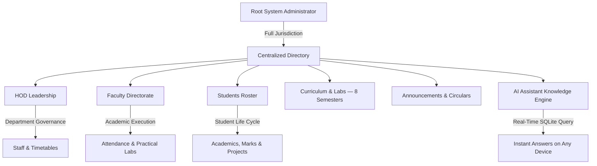

# V.S.B. Engineering College (Autonomous)
## Department of Artificial Intelligence & Data Science (AI & DS) — Enterprise Digital Portal

---

## 💻 TECHNOLOGY STACK
- **Next.js 14.2.5**
- **TypeScript 5.0+**
- **Tailwind CSS 3.4**
- **Prisma ORM 5.17**
- **SQLite Database**
- **AI Assistant — Gemini NLP**

---

## 📋 EXECUTIVE OVERVIEW
The **V.S.B. AI & DS Digital Portal** is a production-grade, full-stack enterprise institutional management platform tailored for the Department of Artificial Intelligence & Data Science.  
Built with modern web engineering standards, the system unifies students, faculty, department leadership, and system administrators into an integrated, real-time reactive ecosystem.

---

## 🏗️ KEY FEATURES & ARCHITECTURE



---

## 👥 ROLE-BASED PORTALS & CAPABILITIES

### SUPER ADMINISTRATOR COMMAND CENTER (`/admin`)
- **Centralized Administrative Directory**: 12 modular subsystems covering User Accounts, Curricula, Question Banks, Capstones, Audit Logs, and System Security.
- **Live Database Counter Metrics**: Real-time SQLite statistics reflecting exact counts of enrolled students, faculty, HOD records, and active circulars.
- **Automated Baseline Seeding & Cleansing**:
  - **1-click "Seed Baseline Data"**: Populates HOD, faculty across 8 semesters, sample students, and circulars.
  - **"Clean Sample Data"**: Restores a pristine state while safely preserving admin accounts.
- **High-Fidelity PDF Vector Engine**: Institutional emblem-watermarked executive audit reports and data exports.

### HEAD OF DEPARTMENT (HOD) LEADERSHIP PORTAL (`/hod-dashboard`)
- **Automated Faculty ID & Onboarding**: Auto-assigned identifiers such as `HOD001`, `HOD002`, optional email, and default temporary password configured by admin.
- **First-Time Login Profile Completion**: Forces new HODs to customize credentials and bio upon initial sign-in.
- **Academic Governance**: Department-wide oversight of Class Advisors, laboratory handlers, research publications, and end-semester practical schedules.

### FACULTY DIRECTORATE & CLASS ADVISORS (`/faculty-dashboard`)
- **8-Semester Faculty Matrix**: Direct assignment as Class Advisors across Semesters 1 to 8 (Sections A & B) and Laboratory Handlers.
- **Institutional 8-Period Bell Timings**: Built-in master timetable matrix for Theory and Practical Blocks:
  - **Forenoon**: 09:15 AM - 12:30 PM
  - **Afternoon**: 01:20 PM - 04:30 PM
- **Attendance & Course Packs**: Daily period-wise attendance marking, lecture slide distribution, and IAT question paper uploads.

### STUDENT ACADEMIC PORTAL (`/dashboard`)
- **8-Semester Curriculum & Marks**: Semester-by-semester view of core theory and practical lab subjects.
- **75% Attendance Compliance Monitor**: Real-time calculation with warning notifications for condonation thresholds below 75%.
- **Capstone Project Hub**: Submission and tracking for:
  - Year 3 Mini Projects — `AD2614`
  - Year 4 Phase I — `AD2711`
  - Capstone Final — `AD2811`
- **On-Duty (OD) & Leave Application**: Digital workflow for symposiums, sports, and medical leaves, with support for submitting applications, uploading supporting documents, tracking approval status, and maintaining an auditable record of requests.

---

## 🗺️ PAGE WORKFLOWS & NAVIGATION PATHS

### 🎓 STUDENT WORKFLOW

#### Login (`/login`)
Authenticate using Register Number and Password.

#### Onboarding (First Login)
Complete 2-step verification including:
- Email OTP verification
- Permanent password setup
- Profile validation
- Mobile number
- Parent Mobile
- WhatsApp verification
- Date of Birth
- Blood Group
- Residency
- Transport details

> **Note**: After completing OTP verification, a small pop-up opens to display the entered details for confirmation. Review all information carefully and select **Next** to proceed to the dashboard. If any details are incorrect, contact the administrator to request the necessary changes before continuing.

#### Dashboard (`/dashboard`)
Central hub showing:
- Current semester progress
- Recent announcements
- Quick access cards

#### Resources (`/dashboard/resources`)
Access:
- Course materials
- PDFs
- Lab manuals
- Slide decks uploaded by faculty

#### Attendance (`/dashboard/attendance`)
View daily attendance percentage in the dashboard, including attendance recorded for each day and the overall attendance percentage across all 8 periods.

#### Other Features
- **Academics & Marks**: `/dashboard/study`
- **Projects & Capstone**: `/dashboard/projects`
- **Question Papers Bank**: `/dashboard/question-papers`
- **Events & OD**: `/dashboard/events`
- **Live AI Chat**: A real AI chatbot powered by Google Gemini, with secure access to the portal's live database and knowledge base. Students can ask natural-language questions about curriculum, subjects, laboratory schedules, faculty, attendance, announcements, timetables, academic resources, projects, and department procedures. The chatbot retrieves current information in real time, provides context-aware answers, supports follow-up questions, and clearly indicates when information is unavailable. It is available through a floating chat widget on every student portal page and preserves the conversation context during the active session.

---

### 👨‍🏫 FACULTY WORKFLOW

The faculty role is divided into two responsibilities:

#### CLASS ADVISOR
The Class Advisor has complete access to the details of their assigned class, including student profiles, academic information, attendance records, announcements, and class-related activities.
- **Class Details**: View and manage the complete student list, section information, semester details, academic performance, and attendance status of the assigned class.
- **Morning Attendance Responsibility**: The Class Advisor is responsible for recording the morning attendance of all students in the assigned class.
- **Attendance Monitoring**: Track daily attendance, identify students with attendance shortages, and monitor compliance with the minimum attendance requirement.
- **Student Support**: Review student information, follow up on absences, approve or recommend leave and On-Duty applications, and communicate important announcements to the class.
- **Class Reports**: Generate and review class-wise attendance, academic, and student activity reports.

#### SUBJECT FACULTY
Subject Faculty members are responsible for managing the subjects and periods assigned to them.
- **Assigned Subjects**: View the subjects, classes, sections, and periods allocated by the department or HOD.
- **Subject Period Display**: The dashboard displays the subject name, class, section, date, and period assigned to the faculty member.
- **Period-Wise Attendance**: After completing the assigned subject period, the faculty member must open that period and record attendance for the corresponding class.
- **Attendance Submission**: Attendance can be marked only for the assigned subject and scheduled period. Once submitted, the attendance record is stored in the system for student and advisor access.
- **Academic Resources**: Upload lecture notes, study materials, laboratory manuals, assignments, and question papers for the assigned subject.
- **Student Performance**: View subject-wise attendance and academic performance for the assigned class or section.
- **Communication**: Share subject-related announcements, instructions, and learning resources with students.

#### Faculty Navigation & Functions
- **Login (`/login`)**: Use the assigned Faculty ID, such as `FAC001`, and the assigned password.
- **Dashboard (`/faculty-dashboard`)**: The dashboard displays the faculty member's role, assigned classes, subjects, periods, attendance responsibilities, and recent announcements.
- **Class Advisor Portal (`/faculty-dashboard/advisor` / `/faculty-dashboard/students`)**:
  - View complete details of their assigned class
  - View student profiles and academic information
  - Record mandatory morning attendance
  - Monitor daily and overall class attendance
  - Identify attendance shortages
  - Review and manage class-related leave and On-Duty applications
  - Publish announcements to their assigned class
  - Generate class-wise attendance and academic reports
- **Subject Faculty Portal (`/faculty-dashboard/subjects`)**:
  - View assigned subjects and classes
  - View the subject timetable and allocated periods
  - Open the scheduled subject period
  - Mark attendance for the class after completing the period
  - View subject-wise attendance records
  - Upload study materials, lecture notes, laboratory manuals, and assignments
  - Manage question papers and subject-related resources
- **Attendance Management (`/faculty-dashboard/attendance`)**:
  - Class Advisors record the morning attendance for their assigned class.
  - Subject Faculty record attendance for the specific subject and period assigned to them.
  - The system displays the class, section, subject, date, and period before attendance is submitted.
  - Attendance records are immediately available to students, Class Advisors, HODs, and authorized administrators.
  - Submitted attendance is maintained in the audit history for transparency and accountability.
- **Students View (`/faculty-dashboard/students`)**:
  - Class Advisors monitor academic progress, review shortages, and approve OD applications.
  - Subject Faculty view enrolled students and monitor subject participation.
- **Other Features**: Manage assigned question papers, upload subject resources, mentor and monitor capstone projects, broadcast announcements, view institutional timetable, and access reports.

---

### 👑 HOD WORKFLOW

#### Login & Onboarding (`/login`)
- Authenticate using HOD credentials / ID (such as `HOD001`).
- Complete 2-step verification including Email OTP, password setup, and profile details.

#### Dashboard (`/hod-dashboard`)
Central hub showing:
- High-level department-wide statistics (Total students, Active faculty, Overall attendance metrics)
- Year-wise absentee records posted by the Class Advisor
- Section-wise absentee filtering and viewing
- Quick access cards

#### Resources (`/hod-dashboard/resources` & `/dashboard/resources`)
Access:
- Course materials
- PDFs
- Lab manuals
- Slide decks uploaded by faculty
- Class schedules and materials for classes handled by the HOD

#### Attendance Management & Analytics (`/hod-dashboard/attendance` & `/hod-dashboard/reports`)
- View real-time attendance across 8 periods and overall percentages.
- View absentees posted by the Class Advisor.
- Filter absentee records year-wise and section-wise.
- Mark and manage attendance for classes handled by the HOD.
- Generate department-wise attendance and absenteeism reports.
- View attendance and absenteeism reports as bar graphs and charts.
- Download attendance reports in PDF, Excel, or CSV format.
- Downloadable attendance reports with student-wise, year-wise, section-wise, and department-wise summaries.
- Compare attendance percentages and absentee counts using visual bar charts.

#### Faculty & Academic Governance (`/hod-dashboard/faculty` & `/hod-dashboard/academics`)
- Assign subjects
- Map class advisors
- Track faculty workload & subjects
- View comprehensive academic reports, placement statistics, and printable PDF audits

---

### 🛡️ ADMIN WORKFLOW

#### Login (`/login`)
Super admin email, OTP verification for the default email ID `lonelyboy44y@gmail.com`, and secure password.

#### Dashboard (`/admin/dashboard`)
Live monitoring of:
- System metrics
- Active users
- Database health
- Activity logs

#### User Provisioning
- `/admin/students`
- `/admin/faculty`
- `/admin/hod`
  - Add new user records
  - Configure temporary passwords
  - Handle password resets for locked accounts

#### System Settings (`/admin/settings`)
Configure:
- Academic year
- Current semester
- Portal name
- Maintenance mode

#### Global Resources (`/admin/resources`)
Master view to manage, audit, and delete files across the entire portal.

---

## 🔬 COMPLETE 8-SEMESTER LABORATORY CURRICULUM

> **Note**: The administrator can add, update, and remove semester, course, laboratory, and schedule details through the admin portal.

| Semester | Code | Practical Laboratory Course | Schedule / Session |
| :--- | :--- | :--- | :--- |
| **Sem 1** | `GE2111` | Problem Solving & Python Programming Laboratory | Afternoon (`01:20 PM - 04:30 PM`) |
| **Sem 1** | `BS2112` | Physics and Chemistry Laboratory | Forenoon (`09:15 AM - 12:30 PM`) |
| **Sem 1** | `GE2113` | Engineering Graphics & CAD Laboratory | Afternoon (`01:20 PM - 04:30 PM`) |
| **Sem 2** | `CS2211` | C Programming & Data Structures Laboratory | Forenoon (`09:15 AM - 12:30 PM`) |
| **Sem 2** | `EE2212` | Basic Electrical & Electronics Engineering Laboratory | Afternoon (`01:20 PM - 04:30 PM`) |
| **Sem 2** | `GE2213` | Workshop Practice Laboratory | Afternoon (`01:20 PM - 04:30 PM`) |
| **Sem 3** | `AD2311` | Object Oriented Programming Laboratory (OOP Lab) | Afternoon (`01:20 PM - 04:30 PM`) |
| **Sem 3** | `AD2312` | Database Management Systems Laboratory (DBMS Lab) | Forenoon (`09:15 AM - 12:30 PM`) |
| **Sem 3** | `AD2313` | Data Structures and Algorithms Laboratory (DSA Lab) | Afternoon (`01:20 PM - 04:30 PM`) |
| **Sem 4** | `AD2411` | Machine Learning Laboratory | Forenoon (`09:15 AM - 12:30 PM`) |
| **Sem 4** | `AD2412` | Operating Systems Laboratory | Afternoon (`01:20 PM - 04:30 PM`) |
| **Sem 4** | `AD2413` | Java & Web Technologies Laboratory | Afternoon (`01:20 PM - 04:30 PM`) |
| **Sem 5** | `AD2511` | Cloud Services & Management Laboratory | Forenoon (`09:15 AM - 12:30 PM`) |
| **Sem 5** | `AD2512` | Big Data Analytics Laboratory | Afternoon (`01:20 PM - 04:30 PM`) |
| **Sem 5** | `AD2513` | Deep Learning Laboratory | Afternoon (`01:20 PM - 04:30 PM`) |
| **Sem 5** | `AD2514` | Business Analytics Laboratory | Forenoon (`09:15 AM - 12:30 PM`) |
| **Sem 5** | `AD2515` | Communication Training | Period 7 & 8 (`03:05 PM - 04:30 PM`) |
| **Sem 5** | `AD2516` | Aptitude & Soft Skills Training | Period 7 & 8 (`03:05 PM - 04:30 PM`) |
| **Sem 5** | `AD2517` | Web Development Laboratory | Afternoon (`01:20 PM - 04:30 PM`) |
| **Sem 6** | `AD2611` | Natural Language Processing Laboratory | Forenoon (`09:15 AM - 12:30 PM`) |
| **Sem 6** | `AD2612` | Computer Vision & Image Processing Laboratory | Afternoon (`01:20 PM - 04:30 PM`) |
| **Sem 6** | `AD2613` | Mobile Application Development Laboratory | Afternoon (`01:20 PM - 04:30 PM`) |
| **Sem 6** | `AD2614` | Mini Project & Product Development | Full Day Practical Block |
| **Sem 7** | `AD2711` | Project Work Phase I (Capstone Research) | Dedicated Practical Block |
| **Sem 7** | `AD2712` | Placement and Training (Corporate Readiness) | Afternoon (`01:20 PM - 04:30 PM`) |
| **Sem 8** | `AD2811` | Project Work Phase II (Capstone Final Implementation) | Dedicated Project Block |
| **Sem 8** | `AD2812` | Industrial Internship & Comprehensive Viva Voce | Autonomous / Industry Evaluation |

---

## ⏰ INSTITUTIONAL 8-PERIOD DAILY BELL TIMINGS

> **Note**: Bell timings for first-year students may differ from the standard institutional schedule.

| Period / Slot | Time Window | Duration | Description |
| :--- | :--- | :--- | :--- |
| **Period 1** | `09:15 AM - 10:00 AM` | 45 mins | Morning Theory / Core Lecture |
| **Period 2** | `10:00 AM - 10:45 AM` | 45 mins | Morning Theory / Core Lecture |
| ☕ **Morning Break** | `10:45 AM - 11:00 AM` | 15 mins | Morning Refreshment Interval |
| **Period 3** | `11:00 AM - 11:45 AM` | 45 mins | Mid-Morning Core / Advanced Theory |
| **Period 4** | `11:45 AM - 12:30 PM` | 45 mins | Mid-Morning Core / Advanced Theory |
| 🍱 **Lunch Break** | `12:30 PM - 01:20 PM` | 50 mins | Midday Dining & Campus Interval |
| **Period 5** | `01:20 PM - 02:05 PM` | 45 mins | Afternoon Theory / Lab Practical Block |
| **Period 6** | `02:05 PM - 02:50 PM` | 45 mins | Afternoon Theory / Lab Practical Block |
| 🍵 **Tea Break** | `02:50 PM - 03:05 PM` | 15 mins | Evening Tea & Refreshment Interval |
| **Period 7** | `03:05 PM - 03:50 PM` | 45 mins | Soft Skills / Communication / Lab |
| **Period 8** | `03:50 PM - 04:30 PM` | 40 mins | Aptitude Bootcamps / Faculty Mentorship |

---

## 📢 MULTI-TARGET CIRCULARS & ANNOUNCEMENTS

The portal features an advanced official circular broadcast system.

### Categorized Options:
- **Academics & Exams**: `ACADEMIC`, `TIMETABLE`, `CURRICULUM`
- **Career & Placement**: `PLACEMENT`, `INTERNSHIP`, `APTITUDE`
- **Symposia & Innovation**: `SYMPOSIUM`, `HACKATHON`, `WORKSHOP`
- **Student Welfare**: `CLUB`, `SCHOLARSHIP`
- **Logistics & Governance**: `FACULTY_NOTICE`, `LOGISTICS`, `GENERAL`

### Target Filtering:
Broadcast specifically to:
- Individual Semesters — Sem 1 to 8
- Academic Years — Years 1 to 4
- Class Advisors Only
- Lab Instructors
- General Campus

---

## 🤖 REAL-TIME DYNAMIC AI CHATBOT ASSISTANT

The floating AI assistant is a production-ready conversational interface connected to the portal's live SQLite database and Google Gemini NLP service.

- **Live Database Integration**: The assistant retrieves current information from students, faculty, HODs, courses, laboratories, timetables, announcements, attendance records, and academic resources through secure server-side database queries.
- **Natural Language Understanding**: Users can ask questions in plain language, such as:
  - *"Who is the Class Advisor for Semester 3?"*
  - *"Show the labs for 2nd year."*
  - *"What are today's bell timings?"*
  - *"What is my current attendance percentage?"*
  - *"Which faculty handles the DBMS laboratory?"*
- **Authenticated and Role-Aware Responses**: Students receive only information permitted for their account and role. Faculty, HODs, and administrators receive expanded responses according to their access privileges.
- **Real-Time Student Lookup**: Search a register number to retrieve authorized student details, year, section, attendance summary, academic information, and assigned advisor.
- **Faculty and HOD Intelligence**: Answer questions about staff names, faculty IDs, course allocations, laboratory responsibilities, class advisors, and department governance.
- **Lab and Timetable Intelligence**: Understand queries about semester laboratories, practical schedules, period timings, faculty assignments, and daily academic activities.
- **Announcement and Resource Search**: Find current circulars, notices, uploaded study materials, question papers, project information, and department updates from the live portal database.
- **Secure AI Architecture**: User messages are processed through a protected server-side API route. Database access is validated before retrieval, sensitive fields are excluded, and the AI receives only the minimum authorized context required to answer.
- **Reliable Response Handling**: If the requested information is unavailable, the assistant clearly states that no matching record was found instead of inventing an answer. Database results are prioritized over general model knowledge.
- **Universal Multi-Table Search**: Newly added records become searchable immediately after they are saved, allowing the assistant to provide current answers without rebuilding the application.
- **Gemini Configuration**: Add a valid `GEMINI_API_KEY` to the `.env` file to enable cloud-based natural language responses. If the key is unavailable, the assistant uses deterministic database search responses for supported portal queries.
- **Example API Flow**: User message → authenticated assistant API → intent detection → authorized SQLite query → structured database context → Gemini response generation → answer displayed in the floating chat widget.
- **Operational Requirements**: The assistant uses server-side credentials, never exposes the Gemini API key in client-side code, validates all user input, enforces role-based access control, and logs failures without storing sensitive conversation content unnecessarily.

---

## 🚀 INSTALLATION & LOCAL SETUP

### PREREQUISITES
- **Node.js** v18.17+ or v20+
- **npm** or **yarn** / **pnpm**
- **Git**

### CLONE REPOSITORY
```bash
git clone https://github.com/logeshwaran2097-hue/AIDS-Digital-Portal.git
cd AIDS-Digital-Portal
```

### INSTALL DEPENDENCIES
```bash
npm install
```

### CONFIGURE ENVIRONMENT VARIABLES
Create a `.env` file in the root directory:
```env
DATABASE_URL="file:./dev.db"
JWT_SECRET="vsb-ai-ds-super-secret-jwt-key-2026"
NEXT_PUBLIC_APP_URL="http://localhost:3001"
GEMINI_API_KEY="" # Optional for Google Gemini Cloud NLP
```

### SETUP DATABASE
```bash
npx prisma generate
npx prisma db push
npm run db:seed
```

### RUN THE APPLICATION

#### Production Build & Run:
```bash
npm run build
npm start
```

#### Or Development Mode:
```bash
npm run dev
```

### APPLICATION URL
[`http://localhost:3001`](http://localhost:3001)

---

## 🔑 DEFAULT CREDENTIALS & ONBOARDING

| Role | Identifier / Email | Default Password | Notes |
| :--- | :--- | :--- | :--- |
| **Super Admin** | `lonelyboy44y@gmail.com` | Custom Admin Password | Tier-0 Full Access (with OTP verification) |
| **HOD** | `HOD001` or assigned ID | Configured by Admin | Prompts profile completion on first login |
| **Faculty** | `FAC001` or assigned ID | Configured by Admin | Prompts password change on first login |
| **Student** | Register Number (e.g. `922522AD001`) | Configured by Admin | Prompts bio completion and permanent password |

---

## 📱 GOOGLE PLAY STORE & APK DEPLOYMENT

The portal is packaged with PWA manifest, service workers, and responsive viewport scaling ready for TWA (Trusted Web Activity) / Android packaging.  
Refer to [`PLAYSTORE_LAUNCH_GUIDE.md`](./PLAYSTORE_LAUNCH_GUIDE.md) for full deployment instructions.

---

## 🏛️ INSTITUTIONAL ACCREDITATION & IDENTITY

- **Institution**: V.S.B. Engineering College (Autonomous)
- **Department**: Department of Artificial Intelligence & Data Science
- **Affiliation**: Anna University, Chennai
- **Approval**: AICTE
- **Accreditation**: NAAC 'A' Grade · NBA Tier-1 Accredited
- **Location**: NH-67, Covai Road, Karur - 639 111, Tamil Nadu, India

---

## 📜 LICENSE & COPYRIGHT

Developed for **V.S.B. Engineering College — Department of AI & DS**.  
**By Logeshwaran G, Second Year AI & DS.**  
All rights reserved.  
© 2026.