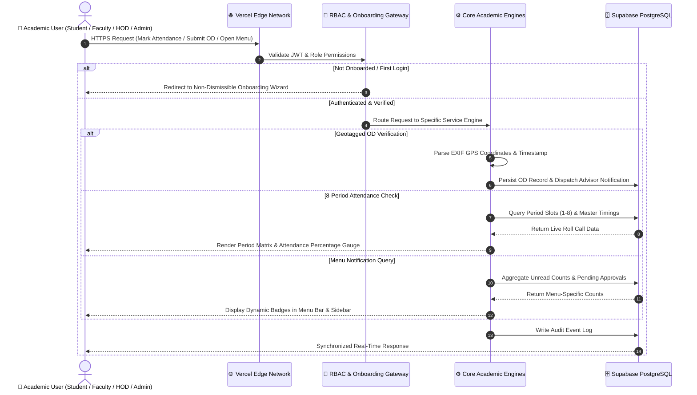
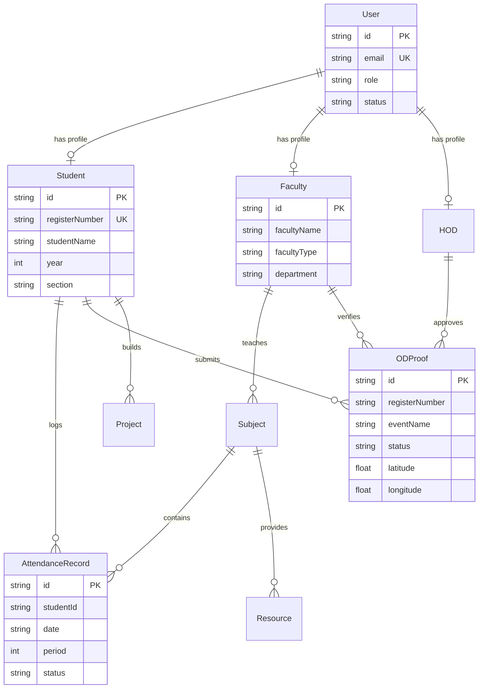

# 🎓 V.S.B. Engineering College (Autonomous)
## 🚀 Department of Artificial Intelligence & Data Science (AI & DS)
### Enterprise Digital Campus Portal · High-Availability Cloud Ecosystem

---

## 📑 Table of Contents
1. [System Overview & Autonomous Purpose](#-1-system-overview--autonomous-purpose)
2. [System Architecture & Data Flow Topology](#-2-system-architecture--data-flow-topology)
3. [Multi-Tier Functional Portals & Capabilities](#-3-multi-tier-functional-portals--capabilities)
   - [A. Student Academic Portal (/dashboard)](#-a-student-academic-portal-dashboard)
   - [B. Faculty Directorate & Class Advisor Portal (/faculty-dashboard)](#-b-faculty-directorate--class-advisor-portal-faculty-dashboard)
   - [C. Head of Department (HOD) Governance Portal (/hod-dashboard)](#-c-head-of-department-hod-governance-portal-hod-dashboard)
   - [D. System Administrator Command Center (/admin)](#-d-system-administrator-command-center-admin)
4. [Specialized Engineering Modules](#-4-specialized-engineering-modules)
   - [4.1. 8-Period Master Attendance Matrix & Timetable Sync](#41-8-period-master-attendance-matrix--timetable-sync)
   - [4.2. Geotagged On-Duty (OD) & Leave Verification Engine](#42-geotagged-on-duty-od--leave-verification-engine)
   - [4.3. Menu-Specific Real-Time Notification Counters](#43-menu-specific-real-time-notification-counters)
   - [4.4. Capstone Projects Lifecycle Hub (AD2614 · AD2711 · AD2811)](#44-capstone-projects-lifecycle-hub-ad2614--ad2711--ad2811)
   - [4.5. Mandatory Non-Dismissible Security Onboarding & 2FA](#45-mandatory-non-dismissible-security-onboarding--2fa)
5. [Institutional Master 8-Period Bell Timings](#-5-institutional-master-8-period-bell-timings)
6. [Database Architecture & Data Integrity Guarantees](#-6-database-architecture--data-integrity-guarantees)
7. [Full-Stack Engineering Specifications](#-7-full-stack-engineering-specifications)
8. [Android Mobile Application & APK Package](#-8-android-mobile-application--apk-package)
9. [Institutional Identity & Accreditation](#-9-institutional-identity--accreditation)

---

## 🌐 1. System Overview & Autonomous Purpose

The **V.S.B. AI & DS Enterprise Digital Portal** is an autonomous institutional ecosystem engineered specifically for the **Department of Artificial Intelligence & Data Science** at **V.S.B. Engineering College (Autonomous), Karur**.

The portal unifies students, faculty members, class advisors, department leadership (HOD), and system administrators into a synchronized, role-based cloud workspace. It digitizes daily academic administration, attendance monitoring, On-Duty (OD) verification, student lifecycle tracking, capstone project milestones, and institutional audits.

### 🎯 Key Architectural Tenets

> [!IMPORTANT]
> **Zero Mock Data Architecture**: The portal contains zero fabricated, mock, or hardcoded seed entries. Every student profile, subject, lab schedule, and attendance record is retrieved in real-time from PostgreSQL. Admin-enrolled accounts represent the single source of truth.

```
⚡ [Student Submission] ───► 👨‍🏫 [Advisor Verification] ───► 👑 [HOD Sanction] ───► 🗄️ [Permanent Ledger]
```

1. **Deterministic Multi-Tier Governance**: Enforces rigid approval flows (`Student Application` ➔ `Class Advisor Verification & Endorsement` ➔ `HOD Final Sanction`).
2. **8-Period Master Institutional Timings**: Native synchronization with V.S.B. daily period bell timings, theory slots, and lab practical blocks.
3. **Mandatory Non-Dismissible Onboarding**: First-time login triggers an unskippable security onboarding wizard enforcing permanent password creation, 2-step email OTP verification, and compulsory **Residency & Transport** declaration.
4. **Geotagged On-Duty (OD) Verification Engine**: Real-time extraction and verification of EXIF GPS coordinates, timestamp validation, interactive map pins, and high-resolution certificate inspection.
5. **Menu-Specific Real-Time Notification Counters**: Live dynamic badges across the top menu bar, mobile drawer, and sidebar navigation displaying exact notification counts per section.

---

## 🏛️ 2. System Architecture & Data Flow Topology

### 🌊 Layer-By-Layer Architectural Breakdown

```
┌────────────────────────┐      ┌─────────────────────────┐      ┌─────────────────────────┐      ┌────────────────────────┐
│  1. CLIENTS & EDGE     │ ───► │  2. SECURITY GATEWAY    │ ───► │  3. CORE MICRO-ENGINES  │ ───► │  4. PERSISTENCE LAYER  │
│  · Student (/dashboard)│      │  · Edge JWT / Jose      │      │  · 8-Period Attendance  │      │  · Supabase PostgreSQL │
│  · Faculty (/faculty)  │      │  · Mandatory Onboarding │      │  · Geotagged OD Engine  │      │  · PgBouncer Port 6543 │
│  · HOD (/hod-dashboard)│      │  · 2-Step Email OTP     │      │  · Menu Notification Hub│      │  · Prisma ORM 5.17     │
│  · Admin (/admin)      │      │  · Rate Limit & Audit   │      │  · Capstone Project Hub │      │  · Render Cloud Worker │
└────────────────────────┘      └─────────────────────────┘      └─────────────────────────┘      └────────────────────────┘
```

#### Layer 1: Presentation & Multi-Role Client Ingestion
- **Edge Routing (Next.js 14 App Router)**: Server-side rendering (SSR) and React Server Components (RSC) for instantaneous page loads.
- **PWA & Native Shell**: Service worker caching for offline shell delivery, paired with Capacitor native Android packaging.
- **Role Isolation**: Strict route boundaries preventing privilege escalation across `/dashboard`, `/faculty-dashboard`, `/hod-dashboard`, and `/admin`.

#### Layer 2: Security & Identity Gateway
- **Edge JWT Interceptor**: Cryptographically signed `jose` tokens stored in `HttpOnly`, `SameSite=Lax` cookies.
- **Non-Dismissible Security Onboarding**: Intercepts unverified accounts on first login—prevents dashboard access until permanent password configuration, email OTP verification, and compulsory hostel/bus residency selection are completed.
- **2-Step Email OTP Engine**: 6-digit cryptographic hash generated and dispatched via SMTP with strict 10-minute expiry windows.
- **Security Audit Logger**: Real-time IP, user-agent, and action timestamps recorded into PostgreSQL.

#### Layer 3: Core Service & Workflow Engines
- **8-Period Master Attendance Matrix**: Calculates daily, weekly, and cumulative attendance across all 8 periods in accordance with V.S.B. autonomous regulations. Automatic visual alerts trigger when attendance dips below 75%.
- **Geotagged On-Duty (OD) Proof Inspector**: Extracts EXIF metadata directly from submitted event images to verify latitude, longitude, reverse-geocoded venue, and photo timestamp before routing to Class Advisor and HOD.
- **Menu-Specific Notification Aggregator**: Real-time aggregation of unread notifications, pending OD approvals, proof reviews, and register unlock requests per menu item.
- **Capstone Projects Pipeline**: Lifecycle management for **AD2614 (Mini-Project)**, **AD2711 (Project Phase I)**, and **AD2811 (Project Phase II)** with milestones, supervisor assignments, GitHub repository links, and abstract validation.
- **Official Institutional PDF Engine**: Client and server-side vector generation of attendance registers, student dossiers, and OD approvals stamped with college watermarks.

#### Layer 4: Cloud Persistence & High Availability
- **Cloud PostgreSQL (Supabase)**: Managed relational database running PostgreSQL 15 with ACID guarantees.
- **PgBouncer Connection Pooling**: Dual-mode connection pooling (Port 6543 for serverless edge handlers and Port 5432 for schema migrations).
- **Prisma ORM 5.17**: Strict schema contracts, transactional integrity, and automated database migrations.
- **Render Worker Engine**: High-availability background service handling asynchronous reporting and health checks.

---

### 🔄 Multi-Tier Request Execution Sequence



---

## 👥 3. Multi-Tier Functional Portals & Capabilities

### Role Hierarchy & Route Allocation
| Role | Portal Route | Primary Identity | Access Scope |
| :--- | :--- | :--- | :--- |
| **Student** | `/dashboard` | Register Number (e.g. `922525243103`) | Personal attendance, OD submissions, study materials, capstone projects, question papers |
| **Faculty** | `/faculty-dashboard` | College Email ID | Period-wise roll-call attendance, subject notes upload, class advisor OD review |
| **Class Advisor** | `/faculty-dashboard` | College Email ID | Dual-role: class section roster, OD endorsement desk, morning attendance, parent alerts |
| **HOD** | `/hod-dashboard` | HOD Email ID | Department-wide analytics, final OD sanctions, attendance register unlocks, faculty workload |
| **Super Admin** | `/admin` | Admin Email ID | User account provisioning, curriculum configuration, master OD pipeline, audit logs |

---

### 🎓 A. Student Academic Portal (`/dashboard`)

```
/dashboard
├── /attendance          -> Daily & period-wise attendance, percentage gauge, condonation alerts
├── /study               -> 8-semester curriculum, units, lecture notes, lab manuals
├── /question-papers     -> IAT exams, model papers, previous semester university questions
├── /projects            -> Capstone milestone submissions, abstracts, GitHub/demo links
├── /od-proofs           -> Geotagged On-Duty applications, certificate uploads, approval tracker
├── /profile             -> Student demographics, hostel/transport info, password changes
├── /events              -> Upcoming department symposiums, hackathons, guest lectures
└── /about               -> Department vision, mission, PEOs, and accreditation status
```

#### Key Student Capabilities:
- **Mandatory Security Onboarding**:
  - Non-dismissible verification workflow requiring completion of profile details.
  - Compulsory **Residency & Transport** selection (Day Scholar college bus route / private transport / campus hostel room).
  - Permanent password configuration and 6-digit Email OTP confirmation.
- **Attendance Compliance Engine**:
  - Real-time gauge showing overall attendance percentage across all completed periods.
  - Visual color cues: Green (>=75%), Warning Amber (70-74.9%), Danger Red (<70%).
  - Detailed calendar matrix logging Forenoon and Afternoon period presences/absences.
- **On-Duty (OD) Submission & Tracking**:
  - Digital application for Technical Symposiums, Hackathons, Sports, and Medical Leave.
  - Upload event participation certificates and geo-tagged photos.
  - Real-time status badge: `Submitted` ➔ `Advisor Approved` ➔ `HOD Approved` (or `Rejected`).
- **Capstone Project Hub**:
  - Dedicated modules for **AD2614 (Mini-Project)**, **AD2711 (Project Phase I)**, and **AD2811 (Project Phase II)**.
  - Submission of project title, domain, abstract, team members, supervisor selection, and GitHub repositories.

---

### 👨‍🏫 B. Faculty Directorate & Class Advisor Portal (`/faculty-dashboard`)

```
/faculty-dashboard
├── /attendance          -> Period-wise and morning roll call registers
├── /students            -> Class Advisor student roster, contact directory, attendance monitor
├── /subjects            -> Assigned theory/lab courses, syllabus units, material upload
├── /od-proofs           -> Advisor verification desk for student OD proofs and certificates
├── /resources           -> Global and course-specific slide decks, lecture PDFs, manuals
├── /question-papers     -> Internal assessment (IAT) paper creator & repository
├── /announcements       -> Targeted notifications to specific classes or subjects
└── /profile             -> Faculty profile, designation, qualification, workload overview
```

#### Dual-Role Faculty Capabilities:
1. **Class Advisor Operations**:
   - **Section Roster**: Instant access to assigned class students (e.g., Year 2 / Sem 3 / Section B).
   - **Morning Attendance**: Daily first-period roll call registering students present/absent.
   - **OD Verification Desk**: Inspect uploaded student event certificates, verify event authenticity, and submit official advisor recommendations to the HOD.
   - **Absentee Monitoring**: Rapid identification of students falling below attendance thresholds with one-click parent contact information.
2. **Subject Faculty Operations**:
   - **Period-Wise Attendance**: Mark attendance immediately following each lecture period.
   - **Course Material Uploads**: Distribute unit-wise notes, presentations, question banks, and lab instructions.
   - **Register Unlock Protocol**: In case of retrospective attendance modifications, submit an unlock request to the HOD stating the justification.

---

### 👑 C. Head of Department (HOD) Governance Portal (`/hod-dashboard`)

```
/hod-dashboard
├── /students            -> Department-wide student directory & enrollment stats
├── /faculty             -> Faculty directory, designation, academic workload distribution
├── /attendance          -> Real-time attendance monitoring across all sections & year batches
├── /od-proofs           -> Multi-tier OD approval monitor (Advisor verified -> HOD sign-off)
├── /academics           -> Subject allocations, semester curricula, lab schedules
├── /projects            -> Department-wide review of capstone projects and guide assignments
├── /events              -> Schedule and publish department symposiums, workshops, seminars
├── /reports             -> Comprehensive PDF, Excel, and CSV attendance/academic reports
└── /notifications       -> Central approval inbox for register unlocks and submissions
```

#### Key HOD Capabilities:
- **Executive Analytics Dashboard**: Real-time counters for Enrolled Students, Teaching Faculty, Active Courses, Projects, and Pending Actions.
- **Advisor OD Verification & Approvals Monitor**: Tracks all student OD applications verified by Class Advisors. Single-click **Approve** (or **Reject**) with automated student notification.
- **Attendance Register Unlock System**: Review faculty requests to unlock past attendance registers with clear audit reasoning.
- **Institutional PDF Report Engine**: Export department attendance summaries, absentee rosters, and academic performance sheets with official college letterhead.

---

### 🛡️ D. System Administrator Command Center (`/admin`)

```
/admin
├── /dashboard           -> Live database metrics, user counters, system health
├── /od-proofs           -> Central OD & proofs tracking pipeline & document inspector
├── /students            -> Manual student registration, bulk CSV template download & upload
├── /faculty             -> Provision faculty accounts, assign designations, initial passwords
├── /hod                 -> Configure HOD profile, credentials, and department leadership
├── /academics           -> 8-semester curriculum builder, lab courses, code allocations
├── /events              -> Campus-wide announcements, circulars, and event schedules
├── /roles               -> Role-based access control (RBAC) permissions & status toggles
├── /settings            -> System parameters, academic year, semester toggle, maintenance mode
└── /audit-logs          -> Security event logging, login timestamps, action history
```

#### Key Admin Capabilities:
- **Central OD & Proofs Tracking System (`/admin/od-proofs`)**:
  - Full institutional lifecycle tracking across all 4 academic years (Years 1 to 4) and sections (A to D).
  - **Visual Proof Inspector**: Inspect modal for live geo-tagged venue photos (GPS coordinates, reverse-geocoded address, capture timestamp, and Google Maps pin) and completion certificates.
  - **Executive Jurisdiction Overrides**: Direct administrative approval, attendance credit certification, clarification directives, and record purging.
  - **Official Audit Exports**: Generation of master OD registries in PDF and CSV.
- **Dynamic Curriculum Administration**:
  - Full CRUD management of departmental subjects and laboratory practicals with semester allocations.
- **Bulk CSV Student Onboarding**:
  - Institutional CSV template upload for rapid, error-free onboarding of student cohorts.

---

## ⚙️ 4. Specialized Engineering Modules

### 4.1. 8-Period Master Attendance Matrix & Timetable Sync
- Synchronized with the official autonomous bell schedule across 8 daily lecture/lab periods.
- Distinguishes between **Morning Session** (Periods 1-4) and **Afternoon Session** (Periods 5-8).
- Real-time compliance engine automatically flags any student falling below 75% attendance with color-coded condonation warnings.

### 4.2. Geotagged On-Duty (OD) & Leave Verification Engine
- Client-side and server-side EXIF metadata parser extracting latitude, longitude, and creation timestamp directly from event venue photos.
- Reverse-geocodes coordinates into verifiable campus addresses and generates interactive Google Maps pins.
- Two-tier digital sign-off pipeline: `Student Submission` ➔ `Class Advisor Verification` ➔ `HOD Final Sanction`.

### 4.3. Menu-Specific Real-Time Notification Counters
- Dedicated background polling and event subscription aggregating pending alerts per menu section.
- **Top Menu Bar**:
  - **Quick Menu Chips**: Prominent pills displayed directly in the header bar showing active menus with unread counts (e.g. `[ Announcements (3) ]`, `[ OD & Leave (2) ]`) for 1-click navigation.
  - **Interactive Menu Updates Dropdown**: Floating card listing each menu with its icon, notification count, and direct link.
- **Sidebar Navigation**:
  - Glowing, animated badges with live counters displayed alongside each navigation link.

### 4.4. Capstone Projects Lifecycle Hub (AD2614 · AD2711 · AD2811)
- Structured milestone management for 3rd and 4th-year engineering capstone tracks.
- Enforces supervisor guide assignment, team formation, domain categorization, abstract validation, and GitHub repository verification.

### 4.5. Mandatory Non-Dismissible Security Onboarding & 2FA
- Automatically intercepts any student or staff account that has not completed primary verification.
- Enforces permanent password configuration, 2-step email OTP verification, and mandatory residency / transport declaration (Day Scholar Bus Route or Hostel Room).

---

## ⏰ 5. Institutional Master 8-Period Bell Timings

The portal's attendance calculations and lecture tracking are synchronized with V.S.B. Engineering College's autonomous daily schedule:

| Period / Slot | Time Window | Duration | Academic Classification | Status |
| :--- | :--- | :--- | :--- | :--- |
| **Period 1** | `09:15 AM - 10:00 AM` | 45 mins | Morning Theory / Core Lecture Slot 1 | Morning Session |
| **Period 2** | `10:00 AM - 10:45 AM` | 45 mins | Morning Theory / Core Lecture Slot 2 | Morning Session |
| **Morning Break** | `10:45 AM - 11:00 AM` | 15 mins | Morning Refreshment Interval | Recess |
| **Period 3** | `11:00 AM - 11:45 AM` | 45 mins | Mid-Morning Core / Advanced Theory Slot 3 | Morning Session |
| **Period 4** | `11:45 AM - 12:30 PM` | 45 mins | Mid-Morning Core / Advanced Theory Slot 4 | Morning Session |
| **Lunch Break** | `12:30 PM - 01:20 PM` | 50 mins | Midday Dining & Campus Interval | Dining |
| **Period 5** | `01:20 PM - 02:05 PM` | 45 mins | Afternoon Theory / Practical Lab Block Slot 5 | Afternoon Session |
| **Period 6** | `02:05 PM - 02:50 PM` | 45 mins | Afternoon Theory / Practical Lab Block Slot 6 | Afternoon Session |
| **Tea Break** | `02:50 PM - 03:05 PM` | 15 mins | Evening Tea & Refreshment Interval | Recess |
| **Period 7** | `03:05 PM - 03:50 PM` | 45 mins | Practical Lab Block / Communication Skills | Afternoon Session |
| **Period 8** | `03:50 PM - 04:40 PM` | 50 mins | Practical Lab Block / Aptitude & Mentorship | Afternoon Session |

---

## 🗄️ 6. Database Architecture & Data Integrity Guarantees



### Core Relational Schema Models:
- **`User`**: Identity model storing role enums (`student`, `faculty`, `hod`, `admin`), hashed credentials, and onboarding state.
- **`Student`**: Academic records including register number, year, semester, section, residency status (Day Scholar / Hosteller), bus route, and parent details.
- **`Faculty`**: Staff identifiers, academic rank, assigned department, and Class Advisor section mapping.
- **`HOD`**: Department executive profile with overriding review and unlock privileges.
- **`Subject`**: Dynamic curriculum database holding subject codes, course names, and laboratory designations.
- **`AttendanceRecord`**: Period-level attendance entries (`present`, `absent`, `od`) timestamped per slot.
- **`ODProof`**: On-duty submissions with document URLs, EXIF GPS coordinates, venue address, advisor endorsements, and HOD approvals.
- **`Project`**: Capstone milestone submissions for AD2614, AD2711, and AD2811 with guide mappings and GitHub repository links.
- **`Notification`**: Broadcast alerts, system announcements, and menu-specific notifications with per-user `readBy` tracking.
- **`AuditLog`**: Tamper-evident ledger recording administrative actions, attendance unlock requests, and authentication events.

---

## 💻 7. Full-Stack Engineering Specifications

| Layer | Technologies & Libraries | Architectural Highlights |
| :--- | :--- | :--- |
| **Frontend Framework** | **Next.js 14** (App Router), **React 18** | Edge rendering, React Server Components, zero-flash routing |
| **Programming Language** | **TypeScript 5.x** | 100% strict type safety across client interfaces and server APIs |
| **UI & Styling** | **Tailwind CSS 3.4**, **Lucide React** | Autonomous glassmorphic dark theme, responsive grid layouts |
| **Backend & Routing** | Next.js Serverless Route Handlers | Secure REST APIs with role-based JWT authorization guards |
| **Database & ORM** | **PostgreSQL 15 (Supabase)**, **Prisma ORM 5.17** | Connection pooling via PgBouncer, ACID transaction safety |
| **Security & Auth** | `bcryptjs`, `jose` JWT, 2-Step Email OTP | HttpOnly session tokens, SHA-256 OTP hashing, zero-trust RBAC |
| **Document Generation** | `jspdf`, `jspdf-autotable` | Official college letterhead, vector watermarks, and verification QR |
| **Mobile & PWA** | Capacitor 6, Service Workers | Offline shell caching, manifest.json, and native Android APK packaging |

---

## 📱 8. Android Mobile Application & APK Package

The V.S.B. AI & DS Portal is fully optimized for mobile devices and available as a standalone Android application:
- **Package Name**: `com.vsb.aidsportal`
- **Application Version**: `v1.0.0`
- **File Size**: `3.9 MB`
- **Package Location**: `public/downloads/Digital-Portal-of-AI-and-DS.apk`
- **Native Capabilities**: Push notifications, full offline shell caching, instant camera attachment for OD photo proof uploads, and biometric login compatibility.

---

## 🏛️ 9. Institutional Identity & Accreditation

### V.S.B. Engineering College (Autonomous)
- **Approvals**: Approved by AICTE, New Delhi
- **Affiliation**: Affiliated to Anna University, Chennai
- **Accreditation**: Accredited with 'A' Grade by NAAC · NBA Tier-1 Accredited
- **Department**: Department of Artificial Intelligence & Data Science
- **Campus Address**: NH-67, Covai Road, Karur - 639 111, Tamil Nadu, India

---

Developed by **Logeshwaran G**  
*Department of Artificial Intelligence & Data Science*  
*All Rights Reserved. © 2026 V.S.B. AI & DS Enterprise Digital Portal.*
