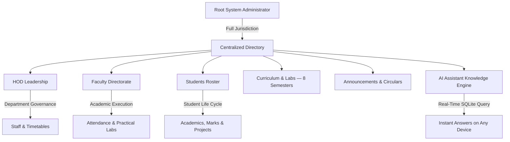

# V.S.B. Engineering College (Autonomous)
## Department of Artificial Intelligence & Data Science (AI & DS) — Enterprise Digital Portal

[](https://nextjs.org/)
[](https://www.typescriptlang.org/)
[](https://tailwindcss.com/)
[](https://www.prisma.io/)
[](https://sqlite.org/)
[](https://ai.google.dev/)

---

### Executive Overview

The **V.S.B. AI & DS Digital Portal** is a production-grade, full-stack enterprise institutional management platform tailored for the Department of Artificial Intelligence & Data Science. Built with modern web engineering standards, the system unifies students, faculty, department leadership, and system administrators into an integrated, real-time reactive ecosystem.

---

## 🏗️ Key Features & Architecture



---

## 👥 Role-Based Portals & Capabilities

### 1. 🛡️ Super Administrator Command Center (`/admin`)
- **Centralized Administrative Directory**: 12 modular subsystems covering User Accounts, Curricula, Question Banks, Capstones, Audit Logs, and System Security.
- **Live Database Counter Metrics**: Real-time SQLite statistics reflecting exact counts of enrolled students, faculty, HOD records, and active circulars.
- **Automated Baseline Seeding & Cleansing**:
  - **`Seed Baseline Data`**: Populates HOD, faculty across 8 semesters, sample students, and circulars.
  - **`Clean Sample Data`**: Restores a pristine state while safely preserving admin accounts.
- **High-Fidelity PDF Vector Engine**: Institutional emblem-watermarked executive audit reports and data exports.

### 2. 👑 Head of Department (HOD) Leadership Portal (`/hod-dashboard`)
- **Automated Faculty ID & Onboarding**: Auto-assigned identifiers such as `HOD001`, `HOD002`, optional email, and default temporary password set by admin.
- **First-Time Login Profile Completion**: Prompts new HODs to customize credentials and complete bio upon initial sign-in.
- **Academic Governance**: Department-wide oversight of Class Advisors, laboratory handlers, research publications, and end-semester practical schedules.

### 3. 👨‍🏫 Faculty Directorate & Class Advisors (`/faculty-dashboard`)
- **8-Semester Faculty Matrix**: Direct assignment as **Class Advisors** across Semesters 1 to 8 (Sections A & B) and **Laboratory Handlers**.
- **Institutional 8-Period Bell Timings**: Built-in master timetable matrix for Theory and Practical Blocks (Forenoon: `09:15 AM - 12:30 PM` | Afternoon: `01:20 PM - 04:30 PM`).
- **Attendance & Course Packs**: Daily period-wise attendance marking, lecture slide distribution, and IAT question paper uploads.

### 4. 🎓 Student Academic Portal (`/dashboard`)
- **8-Semester Curriculum & Marks**: Semester-by-semester view of core theory and practical lab subjects.
- **75% Attendance Compliance Monitor**: Real-time calculation with warning notifications for condonation thresholds below 75%.
- **Capstone Project Hub**: Submission and tracking for:
  - Year 3 Mini Projects — `AD2614`
  - Year 4 Phase I — `AD2711`
  - Capstone Final — `AD2811`
- **On-Duty (OD) & Leave Application**: Digital workflow for symposiums, sports, and medical leaves with document uploads and real-time approval tracking.

---

## 🗺️ Page Workflows & Navigation Paths

### 🎓 1. Student Workflow

#### 🔑 Login (`/login`)
- Authenticate using **Register Number** (e.g., `922522AD001`) and **Password**.

#### 🚀 Onboarding (First Login)
Complete 2-step verification including:
- Email OTP verification (6-digit verification code)
- Permanent password setup
- Profile validation
- Student Mobile Number & Parent Mobile Number (with WhatsApp availability check)
- Date of Birth
- Blood Group
- Residency Status (Hostel / Dayscholar with transport details: Bus No, Boarding Point)
- Hostel Details (Boys / Girls Hostel Blocks 1, 2, or 3 and Room Number)
- **Review Confirmation**: After completing OTP verification, a modal displays the entered details for confirmation. Review all information carefully and select **Next** to proceed to the dashboard. If any details are incorrect, raise a request for admin correction.

#### 📊 Dashboard (`/dashboard`)
Central hub showing:
- Current semester progress
- Recent announcements & circulars
- Quick access cards for academic tools

#### 📚 Resources (`/dashboard/resources`)
Access:
- Course materials
- PDFs & Lecture Notes
- Lab manuals & Practical Guides
- Slide decks uploaded by faculty

#### 📅 Attendance (`/dashboard/attendance`)
- View daily attendance percentage in the dashboard, including attendance recorded for each day and the overall attendance percentage across all 8 periods.

#### 🌟 Additional Student Features
- **Academics & Marks** (`/dashboard/study`): Internal marks, university grades, and academic standing.
- **Projects & Capstone** (`/dashboard/projects`): Track mini-projects, milestone submissions, and guide feedback.
- **Question Papers Bank** (`/dashboard/question-papers`): Previous year university and IAT question papers.
- **Events & OD** (`/dashboard/events`): Submit On-Duty requests for symposiums, sports, and workshops with document attachments.
- **Live AI Chat**: Floating AI chatbot powered by Google Gemini NLP with live database access. Students can ask natural-language questions about curriculum, timetables, attendance, faculty, announcements, and lab schedules.

---

### 👨‍🏫 2. Faculty Workflow

The faculty role is structured into two core responsibilities:

#### A. Class Advisor Role
- **Class Details**: View and manage the complete student list, section information, semester details, academic performance, and attendance status of the assigned class.
- **Morning Attendance Responsibility**: Record mandatory morning attendance for all students in the assigned class.
- **Attendance Monitoring**: Track daily attendance, identify students with attendance shortages (<75%), and monitor compliance.
- **Student Support**: Review student profiles, follow up on absences, approve or recommend leave/OD applications, and communicate important announcements.
- **Class Reports**: Generate and review class-wise attendance, academic, and student activity reports.

#### B. Subject Faculty Role
- **Assigned Subjects**: View subjects, classes, sections, and periods allocated by the department or HOD.
- **Subject Period Display**: Dashboard displays subject name, class, section, date, and allocated periods.
- **Period-Wise Attendance**: Record attendance for the corresponding class immediately after completing each subject period.
- **Academic Resources**: Upload lecture notes, study materials, laboratory manuals, assignments, and IAT question papers.
- **Student Performance**: View subject-wise attendance and internal marks.
- **Communication**: Share subject-related announcements, instructions, and learning resources with students.

#### 📌 Faculty Navigation Routes
- **Login (`/login`)**: Use Faculty ID (e.g. `FAC001`) and assigned password.
- **Dashboard (`/faculty-dashboard`)**: Faculty overview with schedule, assigned classes, and quick actions.
- **Class Advisor Portal (`/faculty-dashboard/advisor` or `/faculty-dashboard/students`)**: Manage class attendance, student profiles, and OD approvals.
- **Subject Portal (`/faculty-dashboard/subjects`)**: Manage subjects, periods, and study materials.
- **Attendance Management (`/faculty-dashboard/attendance`)**: Record morning and period-wise attendance.
- **Resources Management (`/faculty-dashboard/resources`)**: Upload and distribute materials.
- **Announcements (`/faculty-dashboard/announcements`)**: Broadcast announcements to assigned classes or subjects.

---

### 👑 3. Head of Department (HOD) Workflow

#### 🔑 Login & Onboarding (`/login`)
- Authenticate using **HOD ID** (e.g., `HOD001`) or official email and password.
- Complete first-time profile verification and customize credentials.

#### 📊 Dashboard (`/hod-dashboard`)
Central department governance hub:
- High-level department-wide statistics (Total Students, Active Faculty, Class Averages)
- Year-wise absentee records posted by Class Advisors
- Section-wise absentee filtering and real-time monitoring
- Quick access to all department administration tools

#### 📈 Attendance & Reporting (`/hod-dashboard/attendance` & `/hod-dashboard/reports`)
- Real-time attendance monitoring across all 8 periods.
- Filter absentee records year-wise and section-wise.
- Mark and manage attendance for classes directly handled by the HOD.
- Generate department-wise attendance and absenteeism reports with visual bar graphs and charts.
- Download attendance reports in PDF, Excel, or CSV format with student-wise, year-wise, section-wise, and department-wise summaries.

#### 👨‍🏫 Faculty & Academic Management (`/hod-dashboard/faculty` & `/hod-dashboard/academics`)
- Assign subjects and map Class Advisors across Semesters 1 to 8 (Sections A & B).
- Track faculty workload and curriculum coverage.
- Review and approve academic calendars, event schedules, and resource distributions.

---

### 🛡️ 4. System Administrator Workflow

#### 🔑 Login (`/login`)
- Authenticate with Super Admin email (e.g., `lonelyboy44y@gmail.com`), OTP verification, and secure password.

#### 📊 Dashboard (`/admin/dashboard`)
- Live system health metrics, active user sessions, database statistics, and activity audit logs.

#### 👥 User Provisioning
- **Students (`/admin/students`)**: Add student records manually, set temporary passwords, update profiles, and manage enrollment status.
- **Faculty (`/admin/faculty`)**: Provision faculty accounts, assign designations, and configure teaching allocations.
- **HOD (`/admin/hod`)**: Manage department leadership credentials and permissions.

#### ⚙️ System Settings (`/admin/settings`)
- Configure academic year, current semester, portal name, maintenance mode, and institution parameters.

#### 📁 Global Resources (`/admin/resources`)
- Master directory to audit, manage, and remove uploaded files and resources across the entire portal.

---

## 🔬 Complete 8-Semester Laboratory Curriculum

> **Note**: Administrators can add, update, and manage semester courses, laboratories, and schedules dynamically via the Admin Portal.

| Semester | Code | Practical Laboratory Course | Schedule / Session |
| :--- | :--- | :--- | :--- |
| **Sem 1** | `GE2111` | Problem Solving & Python Programming Laboratory | Afternoon (`01:20 PM - 04:30 PM`) |
| **Sem 1** | `BS2112` | Physics and Chemistry Laboratory | Forenoon (`09:15 AM - 12:30 PM`) |
| **Sem 1** | `GE2113` | Engineering Graphics & CAD Laboratory | Afternoon (`01:20 PM - 04:30 PM`) |
| **Sem 2** | `CS2211` | C Programming & Data Structures Laboratory | Forenoon (`09:15 AM - 12:30 PM`) |
| **Sem 2** | `EE2212` | Basic Electrical & Electronics Engineering Laboratory | Afternoon (`01:20 PM - 04:30 PM`) |
| **Sem 2** | `GE2213` | Workshop Practice Laboratory | Afternoon (`01:20 PM - 04:30 PM`) |
| **Sem 3** | `AD2311` | Object Oriented Programming Laboratory (OOP Lab) | Afternoon (`01:20 PM - 04:30 PM`) |
| **Sem 3** | `AD2312` | Database Management Systems Laboratory (DBMS Lab) | Forenoon (`09:15 AM - 12:30 PM`) |
| **Sem 3** | `AD2313` | Data Structures and Algorithms Laboratory (DSA Lab) | Afternoon (`01:20 PM - 04:30 PM`) |
| **Sem 4** | `AD2411` | Machine Learning Laboratory | Forenoon (`09:15 AM - 12:30 PM`) |
| **Sem 4** | `AD2412` | Operating Systems Laboratory | Afternoon (`01:20 PM - 04:30 PM`) |
| **Sem 4** | `AD2413` | Java & Web Technologies Laboratory | Afternoon (`01:20 PM - 04:30 PM`) |
| **Sem 5** | `AD2511` | Cloud Services & Management Laboratory | Forenoon (`09:15 AM - 12:30 PM`) |
| **Sem 5** | `AD2512` | Big Data Analytics Laboratory | Afternoon (`01:20 PM - 04:30 PM`) |
| **Sem 5** | `AD2513` | Deep Learning Laboratory | Afternoon (`01:20 PM - 04:30 PM`) |
| **Sem 5** | `AD2514` | Business Analytics Laboratory | Forenoon (`09:15 AM - 12:30 PM`) |
| **Sem 5** | `AD2515` | Communication Training | Period 7 & 8 (`03:05 PM - 04:30 PM`) |
| **Sem 5** | `AD2516` | Aptitude & Soft Skills Training | Period 7 & 8 (`03:05 PM - 04:30 PM`) |
| **Sem 5** | `AD2517` | Web Development Laboratory | Afternoon (`01:20 PM - 04:30 PM`) |
| **Sem 6** | `AD2611` | Natural Language Processing Laboratory | Forenoon (`09:15 AM - 12:30 PM`) |
| **Sem 6** | `AD2612` | Computer Vision & Image Processing Laboratory | Afternoon (`01:20 PM - 04:30 PM`) |
| **Sem 6** | `AD2613` | Mobile Application Development Laboratory | Afternoon (`01:20 PM - 04:30 PM`) |
| **Sem 6** | `AD2614` | Mini Project & Product Development | Full Day Practical Block |
| **Sem 7** | `AD2711` | Project Work Phase I (Capstone Research) | Dedicated Practical Block |
| **Sem 7** | `AD2712` | Placement and Training (Corporate Readiness) | Afternoon (`01:20 PM - 04:30 PM`) |
| **Sem 8** | `AD2811` | Project Work Phase II (Capstone Final Implementation) | Dedicated Project Block |
| **Sem 8** | `AD2812` | Industrial Internship & Comprehensive Viva Voce | Autonomous / Industry Evaluation |

---

## ⏰ Institutional 8-Period Daily Bell Timings

> **Note**: Bell timings for first-year students may differ from the standard institutional schedule.

| Period / Slot | Time Window | Duration | Academic Description |
| :--- | :--- | :--- | :--- |
| **Period 1** | `09:15 AM - 10:00 AM` | 45 mins | Morning Theory / Core Lecture |
| **Period 2** | `10:00 AM - 10:45 AM` | 45 mins | Morning Theory / Core Lecture |
| ☕ **Morning Break** | `10:45 AM - 11:00 AM` | 15 mins | Morning Refreshment Interval |
| **Period 3** | `11:00 AM - 11:45 AM` | 45 mins | Mid-Morning Core / Advanced Theory |
| **Period 4** | `11:45 AM - 12:30 PM` | 45 mins | Mid-Morning Core / Advanced Theory |
| 🍱 **Lunch Break** | `12:30 PM - 01:20 PM` | 50 mins | Midday Dining & Campus Interval |
| **Period 5** | `01:20 PM - 02:05 PM` | 45 mins | Afternoon Theory / Lab Practical Block |
| **Period 6** | `02:05 PM - 02:50 PM` | 45 mins | Afternoon Theory / Lab Practical Block |
| 🍵 **Tea Break** | `02:50 PM - 03:05 PM` | 15 mins | Evening Tea & Refreshment Interval |
| **Period 7** | `03:05 PM - 03:50 PM` | 45 mins | Soft Skills / Communication / Lab |
| **Period 8** | `03:50 PM - 04:30 PM` | 40 mins | Aptitude Bootcamps / Faculty Mentorship |

---

## 📢 Multi-Target Circulars & Announcements

The portal features an advanced official circular broadcast system with targeted dispatching:

### Categorized Options
- **Academics & Exams**: `ACADEMIC`, `TIMETABLE`, `CURRICULUM`
- **Career & Placement**: `PLACEMENT`, `INTERNSHIP`, `APTITUDE`
- **Symposia & Innovation**: `SYMPOSIUM`, `HACKATHON`, `WORKSHOP`
- **Student Welfare**: `CLUB`, `SCHOLARSHIP`
- **Logistics & Governance**: `FACULTY_NOTICE`, `LOGISTICS`, `GENERAL`

### Target Filtering
Broadcast specifically to:
- Individual Semesters (Sem 1 to 8)
- Academic Years (Years 1 to 4)
- Class Advisors Only
- Lab Instructors
- General Campus Community

---

## 🤖 Real-Time Dynamic AI Chatbot Assistant

The floating AI assistant is directly integrated with the live SQLite database and Google Gemini NLP service:

- **Live Database Integration**: The assistant retrieves current information from students, faculty, HODs, courses, laboratories, timetables, announcements, attendance records, and academic resources through secure server-side database queries.
- **Natural Language Understanding**: Users can ask natural language questions such as:
  - *"Who is the Class Advisor for Semester 3?"*
  - *"Show the labs for 2nd year."*
  - *"What are today's bell timings?"*
  - *"What is my current attendance percentage?"*
  - *"Which faculty handles the DBMS laboratory?"*
- **Role-Aware Security**: Enforces role-based access control — students receive authorized student context, while faculty/admin queries retrieve administrative data.
- **Instant Student Lookup**: Authorized queries by register number return student credentials, year, section, and advisor.
- **Universal Multi-Table Search**: Newly created records in the database are indexed and immediately queryable in real time.
- **Gemini NLP Fallback**: Configure `GEMINI_API_KEY` in `.env` for generative answers; uses local deterministic DB search if the API key is not supplied.

---

## 🚀 Installation & Local Setup

### 1. Prerequisites
- **Node.js** v18.17+ or v20+
- **npm**, **yarn**, or **pnpm**
- **Git**

### 2. Clone Repository
```bash
git clone https://github.com/logeshwaran2097-hue/AIDS-Digital-Portal.git
cd AIDS-Digital-Portal
```

### 3. Install Dependencies
```bash
npm install
```

### 4. Configure Environment Variables
Create a `.env` file in the root directory:
```env
DATABASE_URL="file:./dev.db"
JWT_SECRET="vsb-ai-ds-super-secret-jwt-key-2026"
NEXT_PUBLIC_APP_URL="http://localhost:3001"
GEMINI_API_KEY="" # Optional for Google Gemini Cloud NLP
```

### 5. Setup Database
```bash
npx prisma generate
npx prisma db push
npm run db:seed
```

### 6. Run the Application
```bash
# Development Mode
npm run dev

# Production Build & Run
npm run build
npm start
```

Visit the application at: **[`http://localhost:3001`](http://localhost:3001)**

---

## 🔑 Default Credentials & Onboarding

| Role | Identifier / Email | Default Password | Notes |
| :--- | :--- | :--- | :--- |
| **Super Admin** | `lonelyboy44y@gmail.com` | Custom Admin Password | Tier-0 Full Access with OTP verification |
| **HOD** | `HOD001` or assigned ID | Configured by Admin | Prompts profile completion on first login |
| **Faculty** | `FAC001` or assigned ID | Configured by Admin | Prompts password change on first login |
| **Student** | Register Number (e.g. `922522AD001`) | Configured by Admin | Prompts 2-step verification, OTP & permanent password |

---

## 📱 Google Play Store & APK Deployment

The portal is packaged with PWA manifest, service workers, and responsive viewport scaling ready for TWA (Trusted Web Activity) / Android packaging. Refer to [`PLAYSTORE_LAUNCH_GUIDE.md`](./PLAYSTORE_LAUNCH_GUIDE.md) for full deployment instructions.

---

## 🏛️ Institutional Accreditation & Identity

- **Institution**: V.S.B. Engineering College (Autonomous)
- **Department**: Department of Artificial Intelligence & Data Science
- **Affiliation**: Anna University, Chennai
- **Approval**: AICTE, New Delhi
- **Accreditation**: NAAC 'A' Grade · NBA Tier-1 Accredited
- **Location**: NH-67, Covai Road, Karur - 639 111, Tamil Nadu, India

---

## 📜 License & Copyright

Developed for **V.S.B. Engineering College — Department of AI & DS**.  
**By Logeshwaran G, Second Year AI & DS.**  
All rights reserved. © 2026.