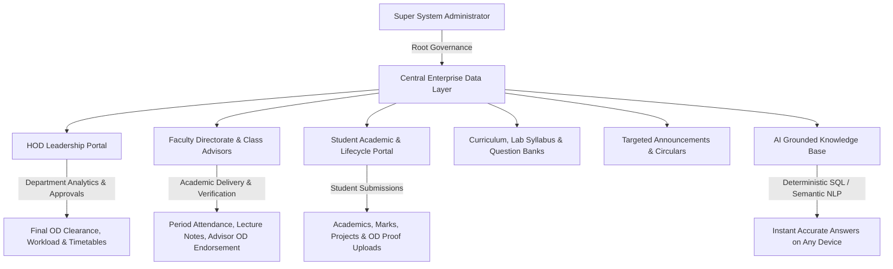

# V.S.B. Engineering College (Autonomous)
## Department of Artificial Intelligence & Data Science (AI & DS) — Enterprise Digital Portal

[](https://nextjs.org/)
[](https://react.dev/)
[](https://www.typescriptlang.org/)
[](https://tailwindcss.com/)
[](https://www.prisma.io/)
[](https://supabase.com/)
[](https://app-two-plum-10.vercel.app)
[](https://render.com)
[](https://ai.google.dev/)
[](https://web.dev/progressive-web-apps/)

---

## 🌐 1. Website Overview & Live Deployment Details

The **V.S.B. AI & DS Enterprise Digital Portal** is an autonomous, full-stack institutional web ecosystem designed specifically for the **Department of Artificial Intelligence & Data Science** at **V.S.B. Engineering College (Autonomous), Karur**.

The portal unifies students, faculty members, class advisors, department leadership (HOD), and system administrators into a synchronized, role-based, real-time environment for academic administration, daily operations, and compliance.

### 🔗 Live Access Points & Service URLs
- **Production Web Application**: [https://app-two-plum-10.vercel.app](https://app-two-plum-10.vercel.app)
- **Primary Domain Alias**: [https://app-4t01s1pjl-logeshwaran.vercel.app](https://app-4t01s1pjl-logeshwaran.vercel.app)
- **Render Background & API Engine**: Service ID `srv-dad5vm2jnfac73ejaf4g`
- **Database Engine**: PostgreSQL on Supabase Cloud Infrastructure (with PgBouncer pooling)
- **Repository**: [https://github.com/logeshwaran2097-hue/AIDS-Digital-Portal](https://github.com/logeshwaran2097-hue/AIDS-Digital-Portal)

### 🎯 Key System Objectives
1. **100% Real-Time Data Integrity**: Strict elimination of mock, sample, or fabricated seed records. If no records exist, interfaces render informative empty states with action triggers.
2. **Multi-Tier Hierarchical Governance**: Enforces authentic institutional approval chains (Student ➔ Class Advisor Verification ➔ HOD Final Approval).
3. **8-Period Master Bell Timings**: Native integration with the daily institutional theory, lab, and refreshment schedule.
4. **Attendance Compliance (<75% Threshold)**: Automated calculation of day-wise, subject-wise, and cumulative attendance percentages with condonation warnings.
5. **High-Fidelity Document Generation**: Client/server vector PDF generators complete with institutional watermarks, QR codes, and formatted summary tables.
6. **Intelligent Natural Language Assistance**: Real-time contextual queries grounded directly in live PostgreSQL records with Google Gemini NLP fallback.

---

## 🏛️ 2. Architectural Blueprint



---

## 👥 3. Role-Based Portals & Functional Modules

The portal implements strict **Role-Based Access Control (RBAC)** across 4 user personas:

| Role | Default Route | Authentication Method | Primary Responsibilities |
| :--- | :--- | :--- | :--- |
| **Student** | `/dashboard` | Register No. + Password + 2-Step OTP | Academics, period attendance tracking, study notes, project capstones, OD proof submissions. |
| **Faculty** | `/faculty-dashboard` | Faculty ID + Password | Period-wise attendance, lecture slides, syllabus tracking, class advisor student monitoring & OD checks. |
| **HOD** | `/hod-dashboard` | HOD ID / Email + Password | Department analytics, advisor OD review & final sign-offs, attendance register unlock approvals, workload mapping. |
| **Admin** | `/admin` | Admin Email + OTP + Password | User provisioning (students/faculty/HOD), bulk CSV onboarding, curriculum setup, security audit logs. |

---

### 🎓 A. Student Academic Portal (`/dashboard`)

```
/dashboard
├── /attendance          -> Daily & period-wise attendance, percentage gauge, condonation alerts
├── /study               -> 8-semester curriculum, units, lecture notes, lab manuals
├── /question-papers     -> IAT exams, model papers, previous semester university questions
├── /projects            -> Capstone milestone submissions, abstracts, GitHub/demo links
├── /od-proofs           -> Geotagged On-Duty applications, certificate uploads, approval tracker
├── /profile             -> Student demographics, hostel/transport info, password changes
├── /events              -> Upcoming department symposiums, hackathons, guest lectures
└── /about               -> Department vision, mission, PEOs, and accreditation status
```

#### Key Student Features:
- **First-Login 2-Step Onboarding**:
  - Email OTP verification (6-digit one-time code).
  - Permanent password configuration.
  - Profile validation: Student mobile, parent WhatsApp contact, blood group, date of birth, day-scholar bus route or hostel room number.
  - Confirmation modal review before entering dashboard.
- **Attendance Compliance Engine**:
  - Real-time gauge showing overall attendance percentage across all completed periods.
  - Visual color cues: Green (>=75%), Warning Amber (70-74.9%), Danger Red (<70%).
  - Detailed calendar matrix logging Forenoon and Afternoon period presences/absences.
- **On-Duty (OD) Submission & Tracking**:
  - Digital application for Technical Symposiums, Hackathons, Sports, and Medical Leave.
  - Upload event participation certificates and geo-tagged photos.
  - Real-time status badge: `Submitted` ➔ `Advisor Approved` ➔ `HOD Approved` (or `Rejected`).
- **Capstone Project Hub**:
  - Dedicated modules for **AD2614 (Mini-Project)**, **AD2711 (Project Phase I)**, and **AD2811 (Project Phase II)**.
  - Submission of project title, domain, abstract, team members, supervisor selection, and GitHub repositories.
- **Floating AI Assistant**:
  - Quick natural language answers for queries like *"Who is my Class Advisor?"*, *"What labs are scheduled for Sem 3?"*, or *"Show today's bell timings."*

---

### 👨‍🏫 B. Faculty Directorate & Class Advisor Portal (`/faculty-dashboard`)

```
/faculty-dashboard
├── /attendance          -> Period-wise and morning roll call registers
├── /students            -> Class Advisor student roster, contact directory, attendance monitor
├── /subjects            -> Assigned theory/lab courses, syllabus units, material upload
├── /od-proofs           -> Advisor verification desk for student OD proofs and certificates
├── /resources           -> Global and course-specific slide decks, lecture PDFs, manuals
├── /question-papers     -> Internal assessment (IAT) paper creator & repository
├── /announcements       -> Targeted notifications to specific classes or subjects
└── /profile             -> Faculty profile, designation, qualification, workload overview
```

#### Dual-Role Faculty Matrix:
1. **Class Advisor Operations**:
   - **Section Roster**: Instant access to assigned class students (e.g., Year 2 / Sem 3 / Section B).
   - **Morning Attendance**: Daily first-period roll call registering students present/absent.
   - **OD Verification Desk**: Inspect uploaded student event certificates, verify event authenticity, and submit official advisor recommendations to the HOD.
   - **Absentee Monitoring**: Rapid identification of students falling below attendance thresholds with one-click parent contact information.
2. **Subject Faculty Operations**:
   - **Period-Wise Attendance**: Mark attendance immediately following each lecture period.
   - **Course Material Uploads**: Distribute unit-wise notes, presentations, question banks, and lab instructions.
   - **Register Unlock Protocol**: In case of retrospective attendance modifications, submit an unlock request to the HOD stating the justification.

---

### 👑 C. Head of Department (HOD) Governance Portal (`/hod-dashboard`)

```
/hod-dashboard
├── /students            -> Department-wide student directory & enrollment stats
├── /faculty             -> Faculty directory, designation, academic workload distribution
├── /attendance          -> Real-time attendance monitoring across all sections & year batches
├── /od-proofs           -> Multi-tier OD approval monitor (Advisor verified -> HOD sign-off)
├── /academics           -> Subject allocations, semester curricula, lab schedules
├── /projects            -> Department-wide review of capstone projects and guide assignments
├── /events              -> Schedule and publish department symposiums, workshops, seminars
├── /reports             -> Comprehensive PDF, Excel, and CSV attendance/academic reports
└── /notifications       -> Central approval inbox for register unlocks and submissions
```

#### Key HOD Features:
- **Executive Analytics Dashboard**:
  - Real-time counters: Total Enrolled Students, Teaching Faculty, Active Courses, Projects, and Pending Actions.
  - Class-wise attendance performance averages with color-coded alerts.
- **Advisor OD Verification & Approvals Monitor**:
  - Tracks all student OD applications verified by Class Advisors.
  - View event details, advisor verification notes, and uploaded certificate documents.
  - Single-click **Approve** (or **Reject**) with automated student notification.
- **Attendance Register Unlock System**:
  - Review faculty requests to unlock past attendance registers with clear audit reasoning.
- **Institutional PDF Report Engine**:
  - Export department attendance summaries, absentee rosters, and academic performance sheets with official college letterhead and watermarks.

---

### 🛡️ D. System Administrator Command Center (`/admin`)

```
/admin
├── /dashboard           -> Live database metrics, user counters, system health
├── /od-proofs           -> Central OD & proofs tracking pipeline & document inspector
├── /students            -> Manual student registration, bulk CSV template download & upload
├── /faculty             -> Provision faculty accounts, assign designations, initial passwords
├── /hod                 -> Configure HOD profile, credentials, and department leadership
├── /academics           -> 8-semester curriculum builder, lab courses, code allocations
├── /events              -> Campus-wide announcements, circulars, and event schedules
├── /roles               -> Role-based access control (RBAC) permissions & status toggles
├── /settings            -> System parameters, academic year, semester toggle, maintenance mode
└── /audit-logs          -> Security event logging, login timestamps, action history
```

#### Key Admin Capabilities:
- **Central OD & Proofs Tracking System (`/admin/od-proofs`)**:
  - Full institutional lifecycle tracking across all 4 academic years (Years 1 to 4) and sections (A to D).
  - **Visual Proof Inspector ("See the Proofs")**: High-resolution inspect modal and inline thumbnails for live geo-tagged venue photos (with GPS coords, reverse-geocoded address, capture timestamp, and Google Maps pin) and completion certificates (with achievement badges, zoom, and direct download).
  - **Executive Jurisdiction Overrides**: Direct administrative sanctioning, attendance credit verification, clarification/resubmission directives, and record deletion.
  - **Official Audit Exports**: One-click generation of the Master Institutional OD Audit Registry in PDF (with college watermark) and CSV.
- **Bulk CSV Student Onboarding**:
  - Download standardized institutional CSV template.
  - Upload entire batches (Register Number, Name, Year, Semester, Section, Email, Phone).
  - Automated credential generation and duplicate collision checking.
- **Zero Mock Data Architecture**:
  - All admin counters and lists link directly to live PostgreSQL tables.
  - Dedicated clean database utilities that preserve administrative accounts while safely pruning test entries.
- **Security & Integrity Protocols**:
  - Bcrypt-hashed credentials, JWT session validation, and strict API route handlers with role authorization guards.

---

## ⏰ 4. Institutional Master 8-Period Bell Timings

The portal incorporates the standard **8-period academic bell timings** of V.S.B. Engineering College:

| Period / Slot | Time Window | Duration | Academic Description |
| :--- | :--- | :--- | :--- |
| **Period 1** | `09:15 AM - 10:00 AM` | 45 mins | Morning Theory / Core Lecture Slot 1 |
| **Period 2** | `10:00 AM - 10:45 AM` | 45 mins | Morning Theory / Core Lecture Slot 2 |
| ☕ **Morning Break** | `10:45 AM - 11:00 AM` | 15 mins | Morning Refreshment Interval |
| **Period 3** | `11:00 AM - 11:45 AM` | 45 mins | Mid-Morning Core / Advanced Theory Slot 3 |
| **Period 4** | `11:45 AM - 12:30 PM` | 45 mins | Mid-Morning Core / Advanced Theory Slot 4 |
| 🍱 **Lunch Break** | `12:30 PM - 01:20 PM` | 50 mins | Midday Dining & Campus Interval |
| **Period 5** | `01:20 PM - 02:05 PM` | 45 mins | Afternoon Theory / Practical Lab Block Slot 5 |
| **Period 6** | `02:05 PM - 02:50 PM` | 45 mins | Afternoon Theory / Practical Lab Block Slot 6 |
| 🍵 **Tea Break** | `02:50 PM - 03:05 PM` | 15 mins | Evening Tea & Refreshment Interval |
| **Period 7** | `03:05 PM - 03:50 PM` | 45 mins | Practical Lab Block / Communication Skills |
| **Period 8** | `03:50 PM - 04:40 PM` | 50 mins | Practical Lab Block / Aptitude & Mentorship |

---

## 🔬 5. Complete 8-Semester Laboratory & Practical Matrix

| Semester | Course Code | Practical Laboratory Course | Scheduled Session |
| :--- | :--- | :--- | :--- |
| **Sem 1** | `GE2111` | Problem Solving & Python Programming Laboratory | Afternoon (`01:20 PM - 04:30 PM`) |
| **Sem 1** | `BS2112` | Physics and Chemistry Laboratory | Forenoon (`09:15 AM - 12:30 PM`) |
| **Sem 1** | `GE2113` | Engineering Graphics & CAD Laboratory | Afternoon (`01:20 PM - 04:30 PM`) |
| **Sem 2** | `CS2211` | C Programming & Data Structures Laboratory | Forenoon (`09:15 AM - 12:30 PM`) |
| **Sem 2** | `EE2212` | Basic Electrical & Electronics Engineering Laboratory | Afternoon (`01:20 PM - 04:30 PM`) |
| **Sem 2** | `GE2213` | Workshop Practice Laboratory | Afternoon (`01:20 PM - 04:30 PM`) |
| **Sem 3** | `AD2311` | Object Oriented Programming Laboratory (OOP Lab) | Afternoon (`01:20 PM - 04:30 PM`) |
| **Sem 3** | `AD2312` | Database Management Systems Laboratory (DBMS Lab) | Forenoon (`09:15 AM - 12:30 PM`) |
| **Sem 3** | `AD2313` | Data Structures and Algorithms Laboratory (DSA Lab) | Afternoon (`01:20 PM - 04:30 PM`) |
| **Sem 4** | `AD2411` | Machine Learning Laboratory | Forenoon (`09:15 AM - 12:30 PM`) |
| **Sem 4** | `AD2412` | Operating Systems Laboratory | Afternoon (`01:20 PM - 04:30 PM`) |
| **Sem 4** | `AD2413` | Java & Web Technologies Laboratory | Afternoon (`01:20 PM - 04:30 PM`) |
| **Sem 5** | `AD2511` | Cloud Services & Management Laboratory | Forenoon (`09:15 AM - 12:30 PM`) |
| **Sem 5** | `AD2512` | Big Data Analytics Laboratory | Afternoon (`01:20 PM - 04:30 PM`) |
| **Sem 5** | `AD2513` | Deep Learning Laboratory | Afternoon (`01:20 PM - 04:30 PM`) |
| **Sem 5** | `AD2514` | Business Analytics Laboratory | Forenoon (`09:15 AM - 12:30 PM`) |
| **Sem 5** | `AD2515` | Communication Training | Period 7 & 8 (`03:05 PM - 04:30 PM`) |
| **Sem 5** | `AD2516` | Aptitude & Soft Skills Training | Period 7 & 8 (`03:05 PM - 04:30 PM`) |
| **Sem 5** | `AD2517` | Web Development Laboratory | Afternoon (`01:20 PM - 04:30 PM`) |
| **Sem 6** | `AD2611` | Natural Language Processing Laboratory | Forenoon (`09:15 AM - 12:30 PM`) |
| **Sem 6** | `AD2612` | Computer Vision & Image Processing Laboratory | Afternoon (`01:20 PM - 04:30 PM`) |
| **Sem 6** | `AD2613` | Mobile Application Development Laboratory | Afternoon (`01:20 PM - 04:30 PM`) |
| **Sem 6** | `AD2614` | Mini Project & Product Development | Dedicated Full Day Practical Block |
| **Sem 7** | `AD2711` | Project Work Phase I (Capstone Research) | Dedicated Practical Block |
| **Sem 7** | `AD2712` | Placement and Training (Corporate Readiness) | Afternoon (`01:20 PM - 04:30 PM`) |
| **Sem 8** | `AD2811` | Project Work Phase II (Capstone Final Implementation) | Dedicated Project Block |
| **Sem 8** | `AD2812` | Industrial Internship & Comprehensive Viva Voce | Autonomous / Industry Evaluation |

---

## 🗄️ 6. Database Schema & Architecture

The database is built on **PostgreSQL (Supabase)** and managed using **Prisma ORM**:

```
+------------------+         +--------------------+         +-------------------+
|      User        | <-----> |      Student       | <-----> |   AttendanceRecord|
| (Auth, Role, JWT)|         | (RegNo, Year, Sec) |         | (Date, Period, P) |
+------------------+         +--------------------+         +-------------------+
         ^                             |                              |
         |                             v                              v
         |                   +--------------------+         +-------------------+
         |                   |      ODProof       |         |      Subject      |
         |                   | (Proof, Geo, Status|         | (Code, Name, Sem) |
         |                   +--------------------+         +-------------------+
         v                             ^                              ^
+------------------+                   |                              |
|     Faculty      | ------------------+------------------------------+
| (FacID, Desig)   |
+------------------+
         ^
         |
+------------------+
|       HOD        | ----> [ Final Approvals, Workload, Governance ]
+------------------+
```

### Core Prisma Models
- `User`: System accounts with role definitions (`student`, `faculty`, `hod`, `admin`), password hashes, and OTP verification states.
- `Student`: Enrolled students with register number, academic year, semester, section, and contact data.
- `Faculty`: Teaching staff, designations, assigned advisor roles, and allocated courses.
- `HOD`: Department leadership profile and executive credentials.
- `Subject`: 8-semester curriculum subjects and practical lab allocations.
- `AttendanceRecord`: Period-wise attendance entries (`present`, `absent`, `od`) linked to students and subjects.
- `ODProof`: Student on-duty submissions with document URLs, geo-tagging, advisor verification notes, and HOD status.
- `Project`: Capstone projects (`AD2614`, `AD2711`, `AD2811`) with milestone progress and GitHub links.
- `Resource` & `QuestionPaper`: Curated notes, PDFs, and question paper banks.
- `Event`: Institutional hackathons, symposiums, workshops, and guest lectures.

---

## 💻 7. Tech Stack & Engineering Standards

| Layer | Technologies Used |
| :--- | :--- |
| **Frontend Framework** | **Next.js 14** (App Router), **React 18**, **TypeScript 5** |
| **Styling & Design** | **Tailwind CSS**, **Lucide React**, Custom Institutional Glassmorphism |
| **Backend & APIs** | Next.js Edge & Node.js Serverless Route Handlers, REST API |
| **Database & ORM** | **PostgreSQL (Supabase)**, **Prisma ORM 5.17** |
| **Authentication** | JWT (JSON Web Tokens), HTTP-Only Cookies, OTP Verification |
| **Document Generation** | `jspdf`, `jspdf-autotable` (Vector-quality institutional PDFs) |
| **AI Integration** | **Google Gemini NLP** with local deterministic SQL fallback |
| **Cloud Hosting** | **Vercel** (Edge Web Hosting) & **Render** (Continuous Service Hosting) |

---

## 🛠️ 8. Local Installation & Development

### 1. Prerequisites
- **Node.js** v18.17+ or v20+
- **npm** or **pnpm**
- **PostgreSQL Database** (e.g., Supabase, Neon, or local Postgres)

### 2. Clone the Repository
```bash
git clone https://github.com/logeshwaran2097-hue/AIDS-Digital-Portal.git
cd AIDS-Digital-Portal
```

### 3. Install Dependencies
```bash
npm install
```

### 4. Configure Environment Variables
Create a `.env` file in the project root:
```env
# PostgreSQL connection pooler (e.g. Supabase PgBouncer)
DATABASE_URL="postgresql://postgres:[PASSWORD]@[HOST]:6543/postgres?pgbouncer=true"

# Direct PostgreSQL connection for Prisma migrations
DIRECT_URL="postgresql://postgres:[PASSWORD]@[HOST]:5432/postgres"

# JWT Secret Key
JWT_SECRET="vsb-ai-ds-super-secret-jwt-key-2026"

# Application URL
NEXT_PUBLIC_APP_URL="http://localhost:3000"

# Google Gemini API Key (Optional)
GEMINI_API_KEY="your-gemini-api-key"
```

### 5. Generate & Synchronize Prisma Schema
```bash
npx prisma generate
npx prisma db push
```

### 6. Start the Development Server
```bash
npm run dev
```

Open **[`http://localhost:3000`](http://localhost:3000)** in your browser.

---

## 🚢 9. Continuous Deployment & Production Pipelines

The project is configured for automated multi-target continuous delivery:

1. **GitHub Main Branch**:
   - Every commit pushed to `main` triggers automatic builds and unit validation.
2. **Vercel Production Deployment**:
   - Production edge builds automatically deploy to [https://app-two-plum-10.vercel.app](https://app-two-plum-10.vercel.app).
3. **Render Cloud Service**:
   - Synchronized API and container service running with zero downtime.

---

## 🏛️ 10. Institutional Identity & Accreditation

- **Institution**: V.S.B. Engineering College (Autonomous)
- **Department**: Department of Artificial Intelligence & Data Science (AI & DS)
- **Affiliation**: Anna University, Chennai
- **Statutory Approval**: AICTE, New Delhi
- **Accreditation**: NAAC 'A' Grade · NBA Tier-1 Accredited
- **Campus Address**: NH-67, Covai Road, Karur - 639 111, Tamil Nadu, India

---

## 📜 11. Author & Copyright

- **Developed By**: **Logeshwaran G**
- **Academic Standing**: Second Year, Department of AI & DS
- **Institution**: V.S.B. Engineering College (Autonomous), Karur
- **License**: All rights reserved. © 2026 V.S.B. AI & DS Enterprise Digital Portal.
