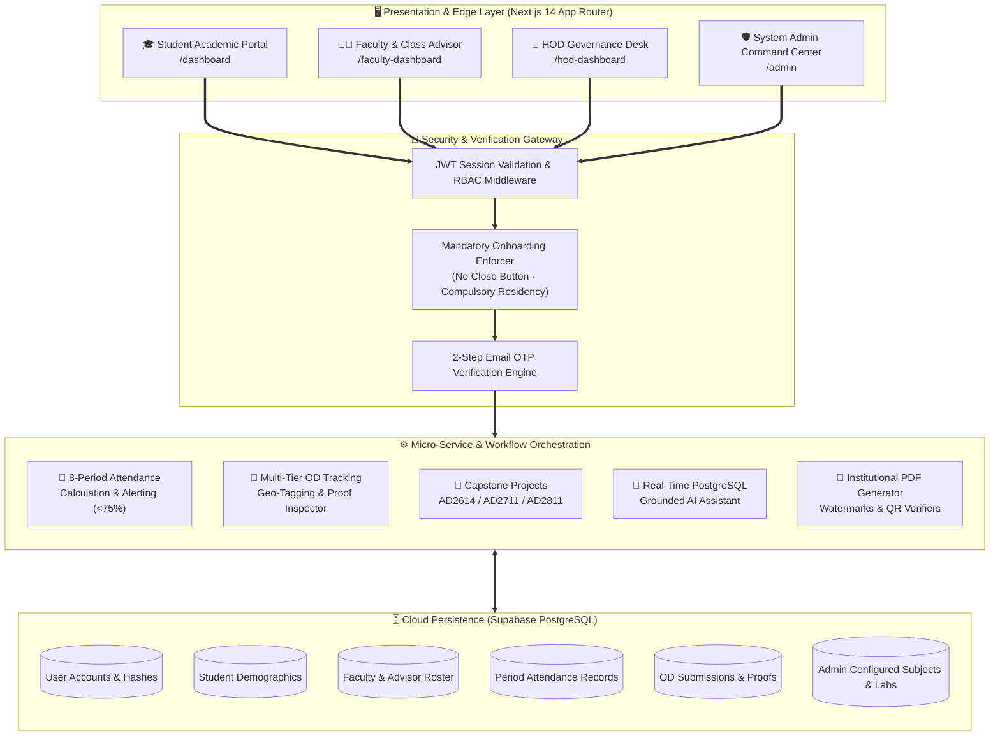

# 🎓 V.S.B. Engineering College (Autonomous)
## 🚀 Department of Artificial Intelligence & Data Science (AI & DS)
### Enterprise Digital Campus Portal · Autonomous Cloud Architecture

<div align="center">


<p align="center">
  <a href="https://app-two-plum-10.vercel.app">
    
  </a>
</p>

<!-- Live Quick Action Links -->
<p align="center">
  <a href="https://app-two-plum-10.vercel.app">
    
  </a>
  <a href="https://github.com/logeshwaran2097-hue/AIDS-Digital-Portal">
    
  </a>
  <a href="#-3-unified-authentication--role-matrix">
    
  </a>
</p>

<!-- Tech Stack Badges -->
<p align="center">
  
  
  
  
  
  
  
  
  
</p>

</div>

---

## 📑 Interactive Navigation Index
```
📁 V.S.B. AI & DS Portal
├── 🌐 1. Overview & Live Deployment Details
├── 🏛️ 2. Architectural System Topology
├── 🔐 3. Unified Authentication & Role Matrix (Exact Specification)
├── 👥 4. Multi-Tier Functional Portals
│   ├── 🎓 A. Student Academic Portal (/dashboard)
│   ├── 👨‍🏫 B. Faculty Directorate & Class Advisor Portal (/faculty-dashboard)
│   ├── 👑 C. Head of Department (HOD) Governance Portal (/hod-dashboard)
│   └── 🛡️ D. System Administrator Command Center (/admin)
├── ⏰ 5. Institutional Master 8-Period Bell Timings
├── 🗄️ 6. Database Architecture & Pure Data Guarantees
├── 💻 7. Full-Stack Engineering Specifications
├── 🛠️ 8. Local Installation & Development
├── 🚢 9. Continuous Deployment Pipelines
└── 🏛️ 10. Institutional Identity & Accreditation
```

---

## 🌐 1. Website Overview & Live Deployment Details

The **V.S.B. AI & DS Enterprise Digital Portal** is a production-grade institutional ecosystem engineered specifically for the **Department of Artificial Intelligence & Data Science** at **V.S.B. Engineering College (Autonomous), Karur**.

The portal unifies students, faculty members, class advisors, department leadership (HOD), and system administrators into a synchronized, role-based cloud workspace. It digitizes daily academic administration, attendance monitoring, On-Duty (OD) verification, student lifecycle tracking, project milestones, and administrative auditing.

### 🔗 Live Access Points & Service URLs
| Service / Channel | Operational State | Target URL / Connection String |
| :--- | :---: | :--- |
| **Primary Production URL** |  | **[https://app-two-plum-10.vercel.app](https://app-two-plum-10.vercel.app)** |
| **Secondary Domain Alias** |  | **[https://app-4t01s1pjl-logeshwaran.vercel.app](https://app-4t01s1pjl-logeshwaran.vercel.app)** |
| **Render API & Worker Engine** |  | Service ID: `srv-dad5vm2jnfac73ejaf4g` (`vsb-aids-portal`) |
| **Enterprise Cloud Database** |  | Supabase Cloud PostgreSQL (PgBouncer Pooling on Port 6543) |
| **Official GitHub Repository** |  | **[AIDS-Digital-Portal on GitHub](https://github.com/logeshwaran2097-hue/AIDS-Digital-Portal)** |

---

### 🎯 Key Architectural Pillars

> [!IMPORTANT]
> **Zero Mock Data Architecture**: The portal contains zero fabricated, mock, or hardcoded seed entries. Every student profile, subject, lab schedule, and attendance record is retrieved in real-time from PostgreSQL. Admin-enrolled accounts represent the single source of truth.

1. **Deterministic Multi-Tier Institutional Governance**: Enforces rigid approval flows (`Student Submission` ➔ `Class Advisor Verification & Endorsement` ➔ `HOD Final Approval`).
2. **8-Period Master Institutional Timings**: Native synchronization with V.S.B. daily period bell timings, lecture slots, and lab practicals.
3. **Mandatory Non-Dismissible Onboarding**: First-time login triggers an unskippable onboarding wizard enforcing permanent password creation, 2-step email OTP verification, and compulsory **Residency & Transport** declaration.
4. **Geotagged On-Duty (OD) Verification Engine**: Real-time extraction and verification of EXIF GPS coordinates, timestamp validation, interactive map pins, and high-resolution certificate inspection.
5. **PostgreSQL-Grounded Natural Language Assistant**: Floating AI assistant answering academic questions grounded directly in live database tables with Google Gemini NLP fallback.

---

## 🏛️ 2. Architectural System Topology



---

## 🔐 3. Unified Authentication & Role Matrix

The platform enforces strict role-based access control (RBAC) with tailored primary identifiers, secondary identifiers, and multi-factor authentication methods:

| Role | Portal Route | Primary Login Identifier | Secondary Login Identifier | Credentials / 2FA |
| :--- | :--- | :--- | :--- | :--- |
| **Student** | `/dashboard` | Register Number (e.g., `922525243103`) | or email id | Password + 2-Step OTP on first login |
| **Faculty** | `/faculty-dashboard` | Official Email ID (e.g., `karthik@gmail.com`) | Faculty Name (e.g., `Karthik S`) | Password |
| **Class Advisor** | `/faculty-dashboard` | Official Email ID (e.g., `karthik@gmail.com`) | Advisor Name (e.g., `Karthik S`) | Password |
| **HOD** | `/hod-dashboard` | Official Email ID (e.g., `hod.aids@gmail.com`) | HOD Name (e.g., `karthik S`) | Password |
| **Super Admin** | `/admin` | Administrator Email ID (e.g., `admin.aids@gamil.com`) | — | Secure Login OTP (Passwordless 2FA via Email) |

---

## 👥 4. Multi-Tier Functional Portals

<details open>
<summary><b>🎓 A. Student Academic Portal (<code>/dashboard</code>)</b> [Click to Expand/Collapse]</summary>

```
/dashboard
├── /attendance          -> Daily & period-wise attendance, percentage gauge, condonation alerts
├── /study               -> 8-semester curriculum, units, lecture notes, lab manuals
├── /question-papers     -> IAT exams, model papers, previous semester university questions
├── /projects            -> Capstone milestone submissions, abstracts, GitHub/demo links
├── /od-proofs           -> Geotagged On-Duty applications, certificate uploads, approval tracker
├── /profile             -> Student demographics, hostel/transport info, password changes
├── /events              -> Upcoming department symposiums, hackathons, guest lectures
└── /about               -> Department vision, mission, PEOs, and accreditation status
```

#### Key Student Features:
- **Enforced First-Time Security Onboarding**:
  - Non-dismissible verification workflow requiring completion of profile details.
  - Compulsory **Residency & Transport** selection (Day Scholar college bus route / private transport / campus hostel room).
  - Permanent password configuration and 6-digit Email OTP confirmation.
- **Attendance Compliance Engine**:
  - Real-time gauge showing overall attendance percentage across all completed periods.
  - Visual color cues: Green (>=75%), Warning Amber (70-74.9%), Danger Red (<70%).
  - Detailed calendar matrix logging Forenoon and Afternoon period presences/absences.
- **On-Duty (OD) Submission & Tracking**:
  - Digital application for Technical Symposiums, Hackathons, Sports, and Medical Leave.
  - Upload event participation certificates and geo-tagged photos.
  - Real-time status badge: `Submitted` ➔ `Advisor Approved` ➔ `HOD Approved` (or `Rejected`).
- **Capstone Project Hub**:
  - Dedicated modules for **AD2614 (Mini-Project)**, **AD2711 (Project Phase I)**, and **AD2811 (Project Phase II)**.
  - Submission of project title, domain, abstract, team members, supervisor selection, and GitHub repositories.
- **Floating AI Assistant**:
  - Quick natural language answers for queries like *"Who is my Class Advisor?"*, *"What labs are scheduled for Sem 3?"*, or *"Show today's bell timings."*
</details>

---

<details open>
<summary><b>👨‍🏫 B. Faculty Directorate & Class Advisor Portal (<code>/faculty-dashboard</code>)</b> [Click to Expand/Collapse]</summary>

```
/faculty-dashboard
├── /attendance          -> Period-wise and morning roll call registers
├── /students            -> Class Advisor student roster, contact directory, attendance monitor
├── /subjects            -> Assigned theory/lab courses, syllabus units, material upload
├── /od-proofs           -> Advisor verification desk for student OD proofs and certificates
├── /resources           -> Global and course-specific slide decks, lecture PDFs, manuals
├── /question-papers     -> Internal assessment (IAT) paper creator & repository
├── /announcements       -> Targeted notifications to specific classes or subjects
└── /profile             -> Faculty profile, designation, qualification, workload overview
```

#### Dual-Role Faculty Matrix:
1. **Class Advisor Operations**:
   - **Section Roster**: Instant access to assigned class students (e.g., Year 2 / Sem 3 / Section B).
   - **Morning Attendance**: Daily first-period roll call registering students present/absent.
   - **OD Verification Desk**: Inspect uploaded student event certificates, verify event authenticity, and submit official advisor recommendations to the HOD.
   - **Absentee Monitoring**: Rapid identification of students falling below attendance thresholds with one-click parent contact information.
2. **Subject Faculty Operations**:
   - **Period-Wise Attendance**: Mark attendance immediately following each lecture period.
   - **Course Material Uploads**: Distribute unit-wise notes, presentations, question banks, and lab instructions.
   - **Register Unlock Protocol**: In case of retrospective attendance modifications, submit an unlock request to the HOD stating the justification.
</details>

---

<details open>
<summary><b>👑 C. Head of Department (HOD) Governance Portal (<code>/hod-dashboard</code>)</b> [Click to Expand/Collapse]</summary>

```
/hod-dashboard
├── /students            -> Department-wide student directory & enrollment stats
├── /faculty             -> Faculty directory, designation, academic workload distribution
├── /attendance          -> Real-time attendance monitoring across all sections & year batches
├── /od-proofs           -> Multi-tier OD approval monitor (Advisor verified -> HOD sign-off)
├── /academics           -> Subject allocations, semester curricula, lab schedules
├── /projects            -> Department-wide review of capstone projects and guide assignments
├── /events              -> Schedule and publish department symposiums, workshops, seminars
├── /reports             -> Comprehensive PDF, Excel, and CSV attendance/academic reports
└── /notifications       -> Central approval inbox for register unlocks and submissions
```

#### Key HOD Features:
- **Executive Analytics Dashboard**: Real-time counters for Enrolled Students, Teaching Faculty, Active Courses, Projects, and Pending Actions.
- **Advisor OD Verification & Approvals Monitor**: Tracks all student OD applications verified by Class Advisors. Single-click **Approve** (or **Reject**) with automated student notification.
- **Attendance Register Unlock System**: Review faculty requests to unlock past attendance registers with clear audit reasoning.
- **Institutional PDF Report Engine**: Export department attendance summaries, absentee rosters, and academic performance sheets with official college letterhead and watermarks.
</details>

---

<details open>
<summary><b>🛡️ D. System Administrator Command Center (<code>/admin</code>)</b> [Click to Expand/Collapse]</summary>

```
/admin
├── /dashboard           -> Live database metrics, user counters, system health
├── /od-proofs           -> Central OD & proofs tracking pipeline & document inspector
├── /students            -> Manual student registration, bulk CSV template download & upload
├── /faculty             -> Provision faculty accounts, assign designations, initial passwords
├── /hod                 -> Configure HOD profile, credentials, and department leadership
├── /academics           -> 8-semester curriculum builder, lab courses, code allocations
├── /events              -> Campus-wide announcements, circulars, and event schedules
├── /roles               -> Role-based access control (RBAC) permissions & status toggles
├── /settings            -> System parameters, academic year, semester toggle, maintenance mode
└── /audit-logs          -> Security event logging, login timestamps, action history
```

#### Key Admin Capabilities:
- **Central OD & Proofs Tracking System (`/admin/od-proofs`)**:
  - Full institutional lifecycle tracking across all 4 academic years (Years 1 to 4) and sections (A to D).
  - **Visual Proof Inspector ("See the Proofs")**: High-resolution inspect modal and inline thumbnails for live geo-tagged venue photos (GPS coordinates, reverse-geocoded address, capture timestamp, and Google Maps pin) and completion certificates.
  - **Executive Jurisdiction Overrides**: Direct administrative approval, attendance credit certification, clarification directives, and record purging.
  - **Official Audit Exports**: Generation of master OD registries in PDF (with college watermark) and CSV.
- **Dynamic Curriculum Administration**:
  - Full CRUD management of departmental subjects and laboratory practicals with semester allocations.
- **Bulk CSV Student Onboarding**:
  - Institutional CSV template upload for rapid, error-free onboarding of student cohorts.
- **Zero-Mock Data Enforcement**:
  - Database utilities ensuring all visual counters and listings reflect live PostgreSQL state without dummy data.
</details>

---

## ⏰ 5. Institutional Master 8-Period Bell Timings

| Period / Slot | Time Window | Duration | Academic Classification |
| :--- | :--- | :--- | :--- |
| **Period 1** | `09:15 AM - 10:00 AM` | 45 mins | Morning Theory / Core Lecture Slot 1 |
| **Period 2** | `10:00 AM - 10:45 AM` | 45 mins | Morning Theory / Core Lecture Slot 2 |
| ☕ **Morning Break** | `10:45 AM - 11:00 AM` | 15 mins | Morning Refreshment Interval |
| **Period 3** | `11:00 AM - 11:45 AM` | 45 mins | Mid-Morning Core / Advanced Theory Slot 3 |
| **Period 4** | `11:45 AM - 12:30 PM` | 45 mins | Mid-Morning Core / Advanced Theory Slot 4 |
| 🍱 **Lunch Break** | `12:30 PM - 01:20 PM` | 50 mins | Midday Dining & Campus Interval |
| **Period 5** | `01:20 PM - 02:05 PM` | 45 mins | Afternoon Theory / Practical Lab Block Slot 5 |
| **Period 6** | `02:05 PM - 02:50 PM` | 45 mins | Afternoon Theory / Practical Lab Block Slot 6 |
| 🍵 **Tea Break** | `02:50 PM - 03:05 PM` | 15 mins | Evening Tea & Refreshment Interval |
| **Period 7** | `03:05 PM - 03:50 PM` | 45 mins | Practical Lab Block / Communication Skills |
| **Period 8** | `03:50 PM - 04:40 PM` | 50 mins | Practical Lab Block / Aptitude & Mentorship |

---

## 🗄️ 6. Database Architecture & Pure Data Guarantees

```
+------------------+         +--------------------+         +-------------------+
|      User        | <-----> |      Student       | <-----> |   AttendanceRecord|
| (Auth, Role, JWT)|         | (RegNo, Year, Sec) |         | (Date, Period, P) |
+------------------+         +--------------------+         +-------------------+
         ^                             |                              |
         |                             v                              v
         |                   +--------------------+         +-------------------+
         |                   |      ODProof       |         |      Subject      |
         |                   | (Proof, Geo, Status|         | (Code, Name, Sem) |
         |                   +--------------------+         +-------------------+
         v                             ^                              ^
+------------------+                   |                              |
|     Faculty      | ------------------+------------------------------+
| (FacID, Desig)   |
+------------------+
         ^
         |
+------------------+
|       HOD        | ----> [ Final Approvals, Workload, Governance ]
+------------------+
```

### Core Schema Models
- **`User`**: Core identity model supporting roles (`student`, `faculty`, `hod`, `admin`), password hashes, and OTP state.
- **`Student`**: Academic records including register number, year, semester, section, residency status, and guardian details.
- **`Faculty`**: Faculty identifiers, designation, department, and class advisor designations.
- **`HOD`**: Department leadership profile with approval privileges.
- **`Subject`**: Dynamic curriculum subjects and laboratories managed by administrators.
- **`AttendanceRecord`**: Granular period-wise attendance entries (`present`, `absent`, `od`).
- **`ODProof`**: On-duty submissions with document URLs, geo-tag metadata, advisor verification notes, and HOD status.
- **`Project`**: Capstone milestone submissions and guide allocations.
- **`Resource` & `QuestionPaper`**: Course study materials and question banks.

---

## 💻 7. Full-Stack Engineering Specifications

| Layer | Technologies & Libraries | Architectural Highlights |
| :--- | :--- | :--- |
| **Frontend Framework** | **Next.js 14** (App Router), **React 18** | Edge rendering, Server Components, dynamic client transitions |
| **Programming Language** | **TypeScript 5.x** | Complete end-to-end type safety across client and server |
| **UI & Styling** | **Tailwind CSS**, **Lucide React** | Custom institutional design system with responsive glassmorphism |
| **Backend & Routing** | Next.js Serverless Route Handlers | Secure REST APIs with role-based JWT authorization guards |
| **Database & ORM** | **PostgreSQL (Supabase)**, **Prisma ORM 5.17** | PgBouncer connection pooling, migration management |
| **Security & Auth** | `bcryptjs`, `jose` JWT, 2-Step Email OTP | HttpOnly session tokens, encrypted credential storage |
| **PDF Engine** | `jspdf`, `jspdf-autotable` | Vector-rendered institutional letterheads, watermarks, and QR codes |
| **AI NLP Assistant** | **Google Gemini API** | Natural language queries grounded in live PostgreSQL data |
| **Hosting & Delivery** | **Vercel** & **Render** | Distributed global CDN edge deployment with background services |

---


## 🚢 8. Continuous Deployment Pipelines

The application is configured for multi-cloud continuous delivery:
- **GitHub Version Control**: All commits to `main` undergo automated validation.
- **Vercel Edge Platform**: Automatic production deployments to [https://app-two-plum-10.vercel.app](https://app-two-plum-10.vercel.app).
- **Render Cloud Service**: High-availability background and worker service (`srv-dad5vm2jnfac73ejaf4g`).

---

## 🏛️ 9. Institutional Identity & Accreditation

<div align="center">

**V.S.B. Engineering College (Autonomous)**  
*Approved by AICTE, New Delhi · Affiliated to Anna University, Chennai*  
*Accredited with 'A' Grade by NAAC · NBA Tier-1 Accredited*  
**Department of Artificial Intelligence & Data Science**  
NH-67, Covai Road, Karur - 639 111, Tamil Nadu, India

---

Developed with ❤️ by **Logeshwaran G**  
*Second Year, Department of AI & DS*  
*All Rights Reserved. © 2026 V.S.B. AI & DS Enterprise Digital Portal.*

<br/>


</div>
